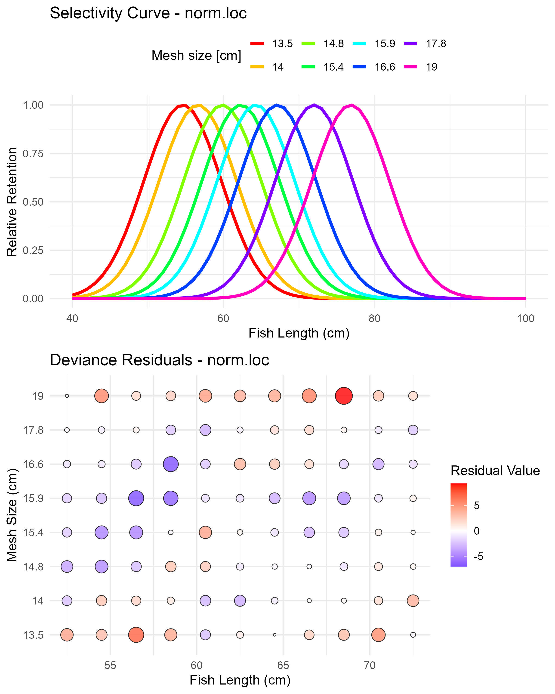
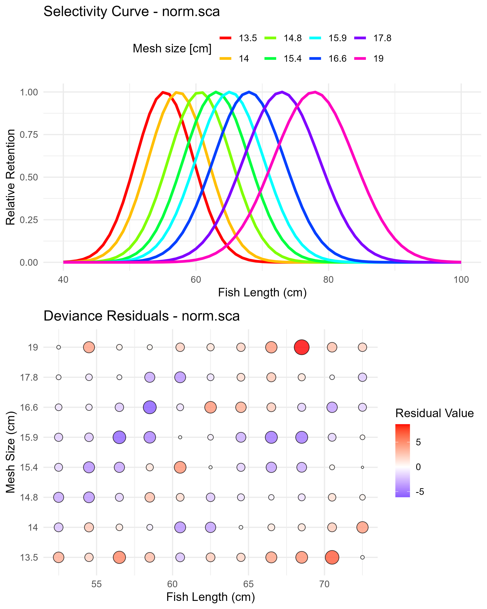
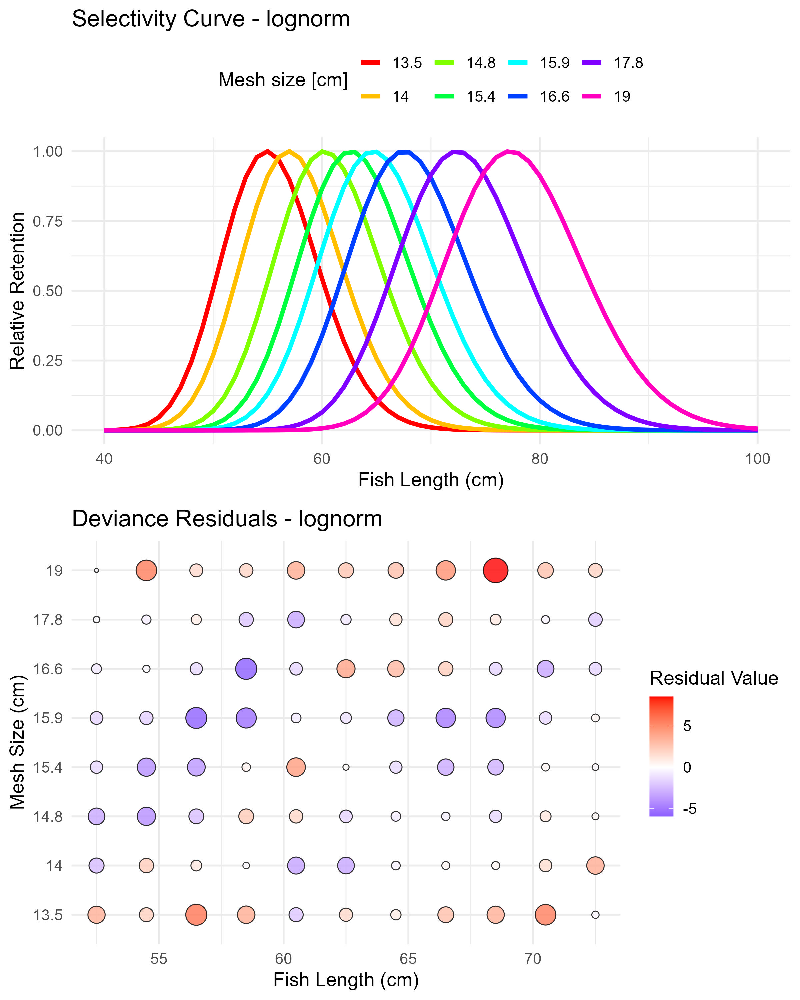
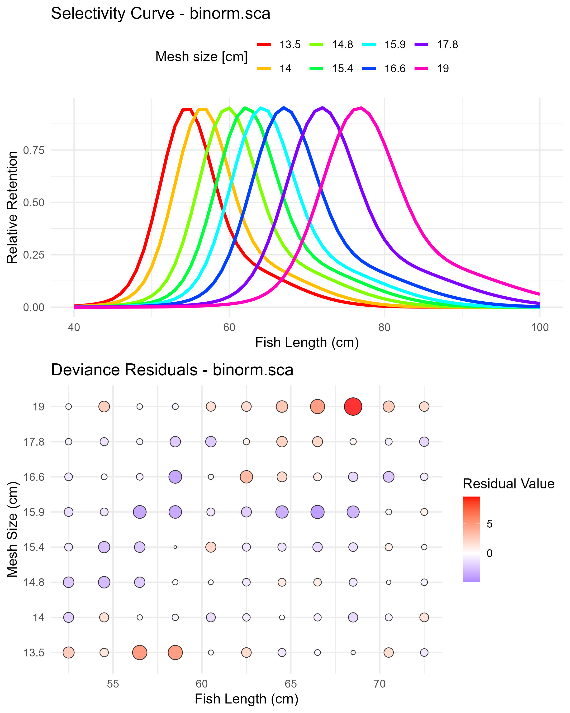
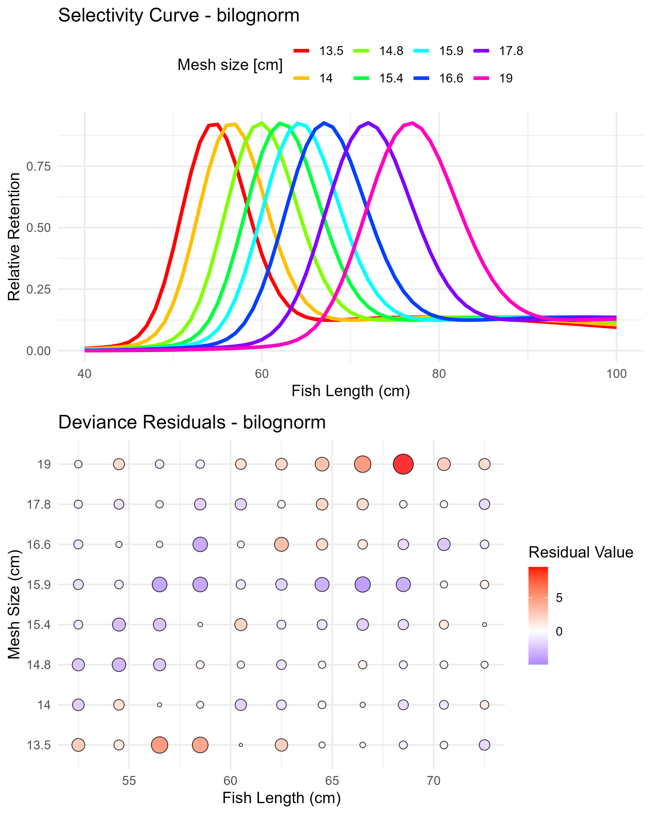
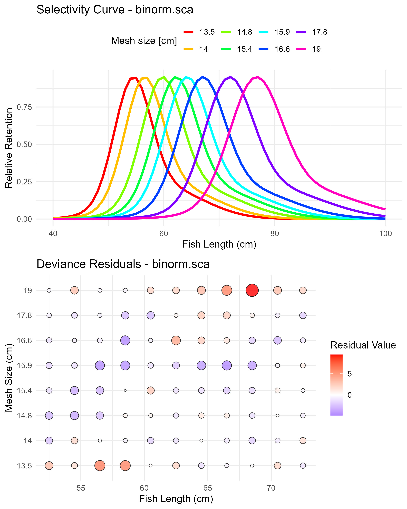
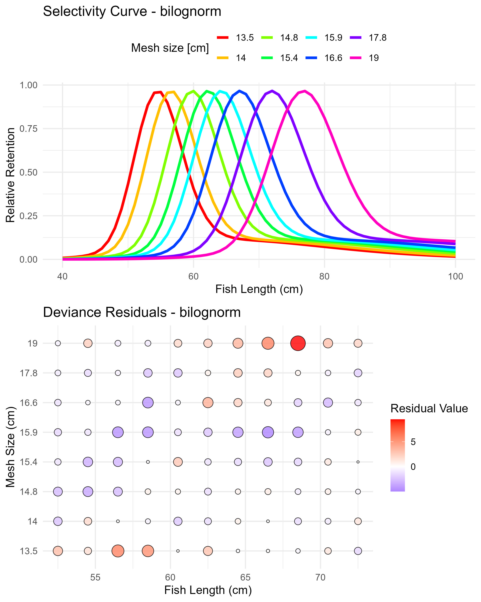

# Examples

## `fit_gillnet_dome` function {#gillnet-selectivity}

This section demonstrates how to use the `fit_gillnet_dome()` function to estimate selectivity parameters for gillnet fisheries. The function fits multiple selectivity models to experimental gillnet data and provides comprehensive model comparison capabilities.

The `fit_gillnet_dome()` function is designed to:

- Fit multiple selectivity curves to gillnet experimental data
- Handle both unimodal and bimodal selectivity patterns
- Provide automatic model comparison and selection
- Generate plots and statistical summaries
- Support both automatic and manual starting value specification

The function expects input data with the following structure:

- Length measurements or frequency data from experimental gillnet fishing
- Multiple mesh sizes tested simultaneously
- Data organized in a format compatible with the package's data processing functions

Loading the package and data:

```{r setup-gillnet, eval=TRUE, echo=TRUE}
# Load the package
library(fishLengthAssess)

# Load the example gillnet data
data("raw_data_gillnet")
input_data <- raw_data_gillnet
input_data

# Define the mesh sizes (cm) used in the experiment
mesh_sizes <- c(13.5, 14.0, 14.8, 15.4, 15.9, 16.6, 17.8, 19)

```

### Example 1 

#### Fitting unimodal models only

In many cases, the user may want to start with simpler unimodal selectivity models before considering more complex bimodal patterns. Setting `run_bimodal = FALSE` fits only the three basic dome-shaped models (i.e., `norm.loc`: Normal common spread, `norm.sca`: Normal scaled spread, and `lognorm`: Lognormal).

```{r unimodal-models, eval=TRUE, echo=TRUE, fig.show='hide', message=FALSE, results='hide'}
# Fit unimodal selectivity models only
result_unimodal <- fit_gillnet_dome(
  input_data = input_data,
  mesh_sizes = mesh_sizes,
  run_bimodal = FALSE,
  output_dir = "model_plots_unimodal",
  length_seq = seq(40, 100, 1)
)
```


The function automatically generates plots for each fitted selectivity model and saves them in the specified output directory (e.g., `model_plots_unimodal`).

```{r normal-loc-example, fig.width=8, fig.height=10, echo=FALSE, out.width="60%",fig.cap="Normal location model (norm.loc) selectivity curves and residuals. The top panel shows the selectivity curves for each mesh size, while the bottom panel displays the deviance residuals."}
# Display the normal location model plot if available
if(file.exists("model_plots_unimodal/Combined_norm.loc.jpeg")) {
  
}
```


```{r normal-sca-example, fig.width=8, fig.height=10, echo=FALSE, out.width="60%",fig.cap="Normal scaled spread model (norm.sca) selectivity curves and residuals. The top panel shows the selectivity curves for each mesh size, while the bottom panel displays the deviance residuals."}
# Display the normal scaled spread model plot if available
if(file.exists("model_plots_unimodal/Combined_norm.sca.jpeg")) {
  
}
```


```{r normal-lognorm-example, fig.width=8, fig.height=10, echo=FALSE, out.width="60%",fig.cap="Lognormal model (lognorm) selectivity curves and residuals. The top panel shows the selectivity curves for each mesh size, while the bottom panel displays the deviance residuals."}
# Display the normal scaled spread model plot if available
if(file.exists("model_plots_unimodal/Combined_lognorm.jpeg")) {
  
}
```


The function returns a comprehensive list object with results for each fitted model. The user can access the objects using the `$` symbol, as follows:

```{r explore-unimodal, eval=TRUE, echo=TRUE}
# Available model results
names(result_unimodal$results)

# Parameter estimates for Normal Location model
print(result_unimodal$results$norm.loc$estimates)

# Parameter estimates for Normal Scale model
print(result_unimodal$results$norm.sca$estimates)

# Parameter estimates for Lognormal model
print(result_unimodal$results$lognorm$estimates)
```

Here is an example of how to access the selection ogive (for all mesh sizes) for the `norm.loc` model.

```{r show-selection-ogive, eval=TRUE, echo=TRUE}
# Selection ogive matrix (selectivity by length and mesh size)
print("Selection Ogive Matrix (first 10 rows):")
print(head(result_unimodal$results$norm.loc$selection_ogive_mat, 10))
```


#### Extracting mesh-specific selectivity

The user can extract selectivity curves for specific mesh sizes:

```{r mesh-specific, eval=TRUE, echo=TRUE}
# Extract selectivity for mesh size 17.8 cm (Normal Location model)
mesh_17_8 <- result_unimodal$selectivity_curves$norm.loc[, c("Length", "17.8")]

# Display first 10 rows
print("Selectivity for 17.8 cm mesh (Normal Location model):")
print(head(mesh_17_8, 20))

# Extract selectivity for mesh size 15.9 cm (Normal common spread model)
mesh_15_9 <- result_unimodal$selectivity_curves$norm.sca[, c("Length", "15.9")]

# Display first 10 rows
print("Selectivity for 15.9 cm mesh (Normal common spread model):")
print(head(mesh_15_9, 20))
```


#### Calculating aggregated selectivity
Use `get_composite_curve()` to calculate the combined selectivity across all mesh sizes. The following example shows how to get the aggregated selectivity for the Normal Location model (`norm.loc`). 

```{r aggregated-selectivity1, eval=TRUE, echo=TRUE}
# Calculate aggregated selectivity curve
aggregated_selectivity <- get_composite_curve(
  result_unimodal$results$norm.loc, 
  length_seq = seq(40, 100, 1)
)

# Display first 10 values
print("Aggregated selectivity curve (first 10 values):")
print(head(aggregated_selectivity, 10))
```

#### Plotting mesh-specific and aggregated selectivity curves

Use `plot_mesh_curves()` to create plots. The following example shows how to plot selectivity for the Normal Location model (`norm.loc`).

```{r plot-mesh-curves1, eval=TRUE, echo=TRUE, fig.cap="Mesh-specific and composite selectivity curves", fig.width=10, fig.height=6}
# Plot selectivity curves for each mesh size
plot_mesh_curves(
  result_unimodal, 
  "norm.loc",
  length_seq = seq(40, 100, 1),
  save_plot = TRUE,
  output_dir = "model_plots_unimodal"
)
```

#### Comparing unimodal models

Use the `compare_stats` function to generate a comprehensive comparison table. This function allows the user to save a CSV file with the outputs.

```{r compare-unimodal, eval=TRUE, echo=TRUE}
# Generate comparison table for unimodal models
comparison_unimodal <- compare_stats(
  result_unimodal,
  include_bimodal = FALSE,
  save_csv = TRUE, 
  filename = "model_plots_unimodal/unimodal_models_comparison.csv"
)
```

```{r comparison-table-example, echo=FALSE, message=FALSE}
# Display an example summary table if available
if(file.exists("model_plots_unimodal/unimodal_models_comparison.csv")) {
  summary_example <- read.csv("model_plots_unimodal/unimodal_models_comparison.csv")
  knitr::kable(summary_example, 
               caption = "Comparison of unimodal selectivity models",
               digits = 2)
}
```


### Example 2

#### Fitting all models, including bimodals models

For more complex selectivity patterns, include bimodal models (`binorm.sca`: Bi-normal model and `bilognorm`: Bi-lognormal) by setting `run_bimodal = TRUE`. This fits all five available selectivity models using automatic starting values.

```{r all-models-auto, eval=TRUE, echo=TRUE, fig.show='hide', message=FALSE, results='hide'}
# Fit all selectivity models
result_all_auto <- fit_gillnet_dome(
  input_data = input_data,
  mesh_sizes = mesh_sizes,
  run_bimodal = TRUE,
  output_dir = "model_plots_all_auto",
  length_seq = seq(40, 100, 1)
)
```

The function automatically generates plots for each fitted selectivity model and saves them in the specified output directory (e.g., `model_plots_all_auto`).


```{r binormsca-example1, fig.width=8, fig.height=10, echo=FALSE, out.width="60%",fig.cap="Binormal sca (binorm.sca) selectivity curves and residuals. The top panel shows the selectivity curves for each mesh size, while the bottom panel displays the deviance residuals."}
# Display the normal location model plot if available
if(file.exists("model_plots_all_auto/Combined_binorm.sca.jpeg")) {
  
}
```

```{r bilognorm-example1, fig.width=8, fig.height=10, echo=FALSE, out.width="60%",fig.cap="Bilognormal model (bilognorm) selectivity curves and residuals. The top panel shows the selectivity curves for each mesh size, while the bottom panel displays the deviance residuals."}
# Display the normal scaled spread model plot if available
if(file.exists("model_plots_all_auto/Combined_bilognorm.jpeg")) {
  
}
```

The function returns a comprehensive list object with results for each fitted model. The user can access the objects using the $ symbol, as follows:

```{r explore-biimodal1, eval=TRUE, echo=TRUE}
# Available model results
names(result_all_auto$results)

# Parameter estimates for binorm.sca model
print(result_all_auto$results$binorm.sca$estimates)

# Parameter estimates for bilognorm model
print(result_all_auto$results$bilognorm$estimates)
```

Here is an example of how to access the selection ogive (for all mesh sizes) for the `binorm` and `bilognorm` models.

```{r show-selection-ogive-binorm, eval=TRUE, echo=TRUE}
# Selection ogive matrix (selectivity by length and mesh size)
print("Selection Ogive Matrix (first 10 rows):")
print(head(result_all_auto$results$binorm.sca$selection_ogive_mat, 10))
```


```{r show-selection-ogive-bilog, eval=TRUE, echo=TRUE}
# Selection ogive matrix (selectivity by length and mesh size)
print("Selection Ogive Matrix (first 10 rows):")
print(head(result_all_auto$results$bilognorm$selection_ogive_mat, 10))
```

#### Extracting mesh-specific selectivity

The user can extract selectivity curves for specific mesh sizes:

```{r mesh-specific2, eval=TRUE, echo=TRUE}
# Extract selectivity for mesh size 14.8 cm (binorm.sca model)
mesh_14_8 <- result_all_auto$selectivity_curves$binorm.sca[, c("Length", "14.8")]

# Display first 10 rows
print("Selectivity for 14.8 cm mesh (binorm.sca model):")
print(head(mesh_14_8, 20))

# Extract selectivity for mesh size 16.6 cm (bilognorm model)
mesh_16_6 <- result_all_auto$selectivity_curves$bilognorm[, c("Length", "16.6")]

# Display first 10 rows
print("Selectivity for 16.6 cm mesh (bilognorm model):")
print(head(mesh_16_6, 20))
```


#### Calculating aggregated selectivity

Use `get_composite_curve()` to calculate the combined selectivity across all mesh sizes. The following example shows how to get the aggregated selectivity for the Bi-normal model (`binorm.sca`).

```{r aggregated-selectivity2, eval=TRUE, echo=TRUE}
# Calculate aggregated selectivity curve
aggregated_selectivity <- get_composite_curve(
  result_all_auto$results$binorm.sca, 
  length_seq = seq(40, 100, 1)
)

# Display first 10 values
print("Aggregated selectivity curve (first 10 values):")
print(head(aggregated_selectivity, 10))
```

#### Plotting mesh-specific and aggregated selectivity curves

Use `plot_mesh_curves()` to create plots. The following example shows how to plot selectivity for the  Bi-normal model (`binorm.sca`).

```{r plot-mesh-curves2, eval=TRUE, echo=TRUE, fig.cap="Mesh-specific and composite selectivity curves", fig.width=10, fig.height=6}
# Plot selectivity curves for each mesh size
plot_mesh_curves(
  result_all_auto, 
  "binorm.sca",
  length_seq = seq(40, 100, 1),
  save_plot = TRUE,
  output_dir = "model_plots_all_auto"
)
```

#### Comparing all models

Use the `compare_stats` function to generate a comprehensive comparison table. This function allows the user to save a CSV file with the outputs.

```{r compare-all2, eval=TRUE, echo=TRUE}
# Generate comparison table for unimodal models
comparison_all_auto <- compare_stats(
  result_all_auto,
  include_bimodal = TRUE,
  save_csv = TRUE, 
  filename = "model_plots_all_auto/all_models_comparison.csv"
)
```


```{r all-model-comparison2, echo=FALSE, message=FALSE}
if (file.exists("model_plots_all_auto/all_models_comparison.csv")) {
  summary_example <- read.csv("model_plots_all_auto/all_models_comparison.csv", stringsAsFactors = FALSE)
  colnames(summary_example) <- gsub("\\.", " ", colnames(summary_example))
  colnames(summary_example) <- gsub("\\s+", " ", colnames(summary_example))
  colnames(summary_example) <- gsub("\\s*\\(cm\\)\\s*", " (cm)", colnames(summary_example))
  knitr::kable(summary_example,
               caption = "Comparison of all selectivity models",
               digits = 2)
}
```

### Example 3

#### Fitting all models, including bimodals with manual starting values

For better control over the optimization process, especially with bimodal models  (`binorm.sca``: Bi-normal model and `bilognorm`: Bi-lognormal), the user can specify manual starting values:

```{r manual-starting-values, eval=TRUE, echo=TRUE, fig.show='hide', message=FALSE, results='hide'}
# Define manual starting values for bimodal models
manual_starts <- list(
  binorm.sca = c(55, 4, 65, 4, 3),     # Mode1, SD1, Mode2, SD2, logit(P1)
  bilognorm = c(4, 0.2, 4.2, 0.1, 2)  # log(mu1), log(sigma1), log(mu2), log(sigma2), logit(P1)
)
# Fit models with manual starting values
result_all_manual <- fit_gillnet_dome(
  input_data = input_data,
  mesh_sizes = mesh_sizes,
  manual_x0_list = manual_starts,
  run_bimodal = TRUE,
  output_dir = "model_plots_all_manual",
  length_seq = seq(40, 100, 1)
)

```

The function automatically generates plots for each fitted selectivity model and saves them in the specified output directory (e.g., `model_plots_all_manual`).

```{r binormsca-example3, fig.width=8, fig.height=10, echo=FALSE, out.width="60%",fig.cap="Binormal sca (binorm.sca) selectivity curves and residuals. The top panel shows the selectivity curves for each mesh size, while the bottom panel displays the deviance residuals."}
# Display the normal location model plot if available
if(file.exists("model_plots_all_manual/Combined_binorm.sca.jpeg")) {
  
}
```

```{r bilognorm-example3, fig.width=8, fig.height=10, echo=FALSE, out.width="60%",fig.cap="Bilognormal model (bilognorm) selectivity curves and residuals. The top panel shows the selectivity curves for each mesh size, while the bottom panel displays the deviance residuals."}
# Display the normal scaled spread model plot if available
if(file.exists("model_plots_all_manual/Combined_bilognorm.jpeg")) {
  
}
```

The function returns a comprehensive list object with results for each fitted model. The user can access the objects using the $ symbol, as follows:

```{r explore-biimodal3, eval=TRUE, echo=TRUE}
# Available model results
names(result_all_manual$results)

# Parameter estimates for binorm.sca model
print(result_all_manual$results$binorm.sca$estimates)

# Parameter estimates for bilognorm model
print(result_all_manual$results$bilognorm$estimates)
```

Here is an example of how to access the selection ogive (for all mesh sizes) for the `binorm` and `bilognorm` models (models fitted using manual starting values).

```{r show-selection-ogive-binorm3, eval=TRUE, echo=TRUE}
# Selection ogive matrix (selectivity by length and mesh size)
print("Selection Ogive Matrix (first 10 rows):")
print(head(result_all_manual$results$binorm.sca$selection_ogive_mat, 10))
```


```{r show-selection-ogive-bilog3, eval=TRUE, echo=TRUE}
# Selection ogive matrix (selectivity by length and mesh size)
print("Selection Ogive Matrix (first 10 rows):")
print(head(result_all_manual$results$bilognorm$selection_ogive_mat, 10))
```

#### Extracting Mesh-Specific Selectivity

The user can extract selectivity curves for specific mesh sizes:

```{r mesh-specific3, eval=TRUE, echo=TRUE}
# Extract selectivity for mesh size 14.8 cm (binorm.sca model)
mesh_14_8 <- result_all_manual$selectivity_curves$binorm.sca[, c("Length", "14.8")]

# Display first 10 rows
print("Selectivity for 14.8cm mesh (binorm.sca model):")
print(head(mesh_14_8, 10))

# Extract selectivity for mesh size 16.6 cm (bilognorm model)
mesh_16_6 <- result_all_manual$selectivity_curves$bilognorm[, c("Length", "16.6")]

# Display first 10 rows
print("Selectivity for 16.6cm mesh (bilognorm model):")
print(head(mesh_16_6, 10))
```

#### Calculating aggregated selectivity

The user can use `get_composite_curve()` to calculate the combined selectivity across all mesh sizes. The following example shows how to get the aggregated selectivity for the Bi-lognormal model (bilognorm).


```{r aggregated-selectivity3, eval=TRUE, echo=TRUE}
# Calculate aggregated selectivity curve
aggregated_selectivity <- get_composite_curve(
  result_all_manual$results$bilognorm, 
  length_seq = seq(40, 100, 1)
)

# Display first 10 values
print("Aggregated selectivity curve (first 10 values):")
print(head(aggregated_selectivity, 10))
```

#### Plotting mesh-specific and aggregated selectivity curves

Use `plot_mesh_curves()` to create plots. The following example shows how to plot selectivity for the Bi-normal model (binorm.sca).

```{r plot-mesh-curves3, eval=TRUE, echo=TRUE, fig.cap="Mesh-specific selectivity curves", fig.width=10, fig.height=6}
# Plot selectivity curves for each mesh size
plot_mesh_curves(
  result_all_manual, 
  "binorm.sca",
  length_seq = seq(40, 100, 1),
  save_plot = TRUE,
  output_dir = "model_plots_all_manual"
)
```

#### Comparing all models
As before, the user can use `compare_stats()` function to generate a comprehensive comparison table. This function allows the user to save a CSV file with the outputs.


```{r compare-all-manual3, eval=TRUE, echo=TRUE}
# Generate comparison table for unimodal models
comparison_all_manual <- compare_stats(
  result_all_manual,
  include_bimodal = TRUE,
  save_csv = TRUE, 
  filename = "model_plots_all_manual/all_models_comparison.csv"
)
```


```{r all-model-comparison-manual3, echo=FALSE, message=FALSE}
if (file.exists("model_plots_all_manual/all_models_comparison.csv")) {
  summary_example <- read.csv("model_plots_all_manual/all_models_comparison.csv", stringsAsFactors = FALSE)
  colnames(summary_example) <- gsub("\\.", " ", colnames(summary_example))
  colnames(summary_example) <- gsub("\\s+", " ", colnames(summary_example))
  colnames(summary_example) <- gsub("\\s*\\(cm\\)\\s*", " (cm)", colnames(summary_example))
  knitr::kable(summary_example,
               caption = "Comparison of all selectivity models",
               digits = 2)
}
```


## GTG dome-shaped LBSPR assessment {#dome-shaped-lbspr}

### Practical Application of GTG Length-Based SPR model including dome-shaped selectivity: Step-by-Step Example

This section demonstrates how to estimate fishing mortality (F/M) and spawning 
potential ratio (SPR) from catch-at-length data using the GTG dome-shaped 
length-based SPR model. The selectivity curve is treated as a **fixed known 
input** — only F/M is estimated. The selectivity parameters are obtained from 
`fit_gillnet_dome()` (see section \@ref(gillnet-fitting)) or defined directly 
by the user.

The example code presented here was adapted from the original implementation (https://github.com/KHommik/DomeShaped_GTG_LBSPR) by @hommik2020, with modifications to accommodate additional selectivity models and updated simulation routines.

Four examples are provided covering two data formats and two sampling designs:

| Example | Data type | Groups |
| ------- | --------- | ------ |
| A | Frequency | 5 groups |
| B | Length | 5 groups |
| C | Frequency | 1 group |
| D | Length | 1 group |

Four example datasets are included in the package to demonstrate the workflow. 
Since the data are simulated with known parameters (`Linf = 120 cm`, `K = 0.2`, 
`M/K = 1.5`, `L50 = 60 cm`, `FM = 1.0`, `Normal.sca` selectivity with 
`SL1 = 55.28` and `SL2 = 4.343513^2`), the user can verify that the estimated 
F/M and SPR values are close to the true values used in the simulation.

| Dataset | Data type | Groups |
| ------- | --------- | ------ |
| `gtg_catch_frequency` | Frequency | 5 |
| `gtg_catch_lengths` | Length | 5 |
| `gtg_catch_frequency_1group` | Frequency | 1 |
| `gtg_catch_lengths_1group` | Length | 1 |


#### Step 1. Load packages and define common inputs

The life history parameters, length bins, and fleet parameters are the same 
across all four examples. Define them once here.

Load the required packages and data:

```{r setup-packages-lbspr, eval=TRUE, echo=TRUE}
library(fishSimGTG)
library(fishLengthAssess)
library(ggplot2)

# --- Life history parameters ---
LifeHistoryObj <- new("LifeHistory")
LifeHistoryObj@title        <- "Fish Stock"
LifeHistoryObj@speciesName  <- "Generic Fish"
LifeHistoryObj@L_type       <- "TL"
LifeHistoryObj@L_units      <- "cm"
LifeHistoryObj@Walpha_units <- "g"
LifeHistoryObj@Linf         <- 120   # asymptotic length (cm)
LifeHistoryObj@K            <- 0.2   # growth rate
LifeHistoryObj@t0           <- 0     # theoretical age at length zero
LifeHistoryObj@L50          <- 60    # length at 50% maturity (cm)
LifeHistoryObj@L95delta     <- 2     # L95 = L50 + L95delta = 62 cm
LifeHistoryObj@MK           <- 1.5   # M/K ratio
LifeHistoryObj@M            <- LifeHistoryObj@MK * LifeHistoryObj@K
LifeHistoryObj@LW_A         <- 0.01  # weight = LW_A x Length ^ LW_B
LifeHistoryObj@LW_B         <- 3
LifeHistoryObj@R0           <- 1E6   # unfished recruitment (does not affect SPR)

# --- Length bins ---
# make_size_bins() automatically builds the correct length range from Linf.
# Change Linc to adjust bin width (default = 1 cm).
SizeBins <- make_size_bins(LifeHistoryObj, Linc = 1)

# --- Fleet parameters: dome-shaped selectivity (fixed) ---
# The selectivity parameters below come from fitting the Normal.sca model
# to the example gillnet data using fit_gillnet_dome() (see Example 1).
# For your own data, replace SL1, SL2, SLmesh, and fishery_mesh with 
# the values from your own selectivity analysis.
#
# IMPORTANT: SL2 must be SQUARED when using Normal.sca.
# select_Millar() returns k2 as a spread coefficient, but 
# GTGDomeLBSPRSim2() expects k2 as a variance coefficient (k2 squared).

FleetPars <- NULL
FleetPars$selectivityCurve <- "Normal.sca"
FleetPars$SL1              <- 55.28          # modal length parameter
FleetPars$SL2              <- 4.343513^2     # spread parameter (SQUARED)
FleetPars$SLmesh           <- 13.5           # reference mesh size (cm)
FleetPars$SLMin            <- NA             # no minimum landing length
FleetPars$use_aggregated   <- FALSE          # use mesh-specific selectivity
FleetPars$fishery_mesh     <- 15.9           # mesh size used in the fishery
FleetPars$FM               <- 1             # starting value for optimization

# ---- Option 2: Normal location (norm.loc) ----
# Use when norm.loc had the lowest deviance in fit_gillnet_dome()
# FleetPars$selectivityCurve <- "Normal.loc"
# FleetPars$SL1              <- 54.6   # k
# FleetPars$SL2              <- 5.14   # sigma (no transformation needed)
# FleetPars$SLmesh           <- 13.5
# FleetPars$SLMin            <- NA
# FleetPars$use_aggregated   <- FALSE
# FleetPars$fishery_mesh     <- 15.9
# FleetPars$FM               <- 1

# ---- Option 3: Lognormal (lognorm) ----
# Use when lognorm had the lowest deviance in fit_gillnet_dome()
# FleetPars$selectivityCurve <- "logNorm"
# FleetPars$SL1              <- 4.01    # mu (no transformation needed)
# FleetPars$SL2              <- 0.080   # sigma (no transformation needed)
# FleetPars$SLmesh           <- 13.5
# FleetPars$SLMin            <- NA
# FleetPars$use_aggregated   <- FALSE
# FleetPars$fishery_mesh     <- 15.9
# FleetPars$FM               <- 1

cat("Selected selectivity curve:", FleetPars$selectivityCurve, "\n")
```


```{r dome-lbspr-true-spr, eval=TRUE, echo=TRUE}
# The true SPR is calculated by running the simulation with the known parameters
# (FM = 1.0). Since the data were simulated with these exact parameters, comparing the estimated SPR and F/M to these true values tells us how well the model recovers the input parameters. Small differences are expected due to multinomial sampling.
simGTG   <- GTGDomeLBSPRSim2(LifeHistoryObj, FleetPars, SizeBins)
true_SPR <- simGTG$SPR
cat("True SPR:", round(true_SPR, 4), "\n")
cat("True F/M: 1.000\n")
```

#### Step 2. Create the `lengthComp` object

The `LengthComp` object is the standard container for catch-at-length data. 
The only slot that changes between examples is `dataType` — set it to 
`"Frequency"` for frequency data or `"Length"` for individual measurements. 
The `observationGroup` slot should always be set to `"Catch"`.

```{r dome-lbspr-lengthcomp, eval=TRUE, echo=TRUE}
# This is shown for illustration — each example below creates its own
# lengthComp object after loading its specific dataset.
lengthComp <- new("LengthComp")
lengthComp@dataType         <- "Frequency"  # "Frequency" or "Length"
lengthComp@L_source         <- "FD"         # "FD" = fishery dependent
lengthComp@L_units          <- "cm"
lengthComp@L_type           <- "TL"         # TL = total length
lengthComp@header           <- TRUE
lengthComp@observationGroup <- "Catch"
```

### Example A: Frequency data — 5 groups {#example-freq-5groups}

Five catch samples in frequency format, representing for example 5 years of 
monitoring data.

```{r dome-lbspr-freq-5groups-data, eval=TRUE, echo=TRUE}
output_dir <- "example_A_freq_5groups"

# Load data
data("gtg_catch_frequency")
sampleCatch <- gtg_catch_frequency
print(head(sampleCatch))

# Create LengthComp object
lengthComp@dt       <- sampleCatch
lengthComp@dataType <- "Frequency"
```

```{r dome-lbspr-freq-5groups-run, eval=TRUE, echo=TRUE, message=FALSE, results='hide'}
results_all <- run_grouped_and_pooled(
  lifeHistoryObj = LifeHistoryObj,
  fixedFleetPars = FleetPars,
  LengthCompObj  = lengthComp,
  SizeBins       = SizeBins,
  Lc             = 0
)
```

```{r dome-lbspr-freq-5groups-results, eval=TRUE, echo=TRUE}
# Pooled F/M and SPR
cat("\n===== POOLED RESULTS =====\n")
print(results_all$pooled$lbPars)

cat("\nStandard error of F/M:\n")
print(results_all$pooled$lbStdErrs)

cat("\nConvergence (0 = success):", results_all$pooled$optimOut$convergence, "\n")

# Per-group results
cat("\n===== PER-GROUP RESULTS =====\n")
results_all$grouped$group_results$Catch_1$lbPars
results_all$grouped$group_results$Catch_2$lbPars
results_all$grouped$group_results$Catch_3$lbPars
results_all$grouped$group_results$Catch_4$lbPars
results_all$grouped$group_results$Catch_5$lbPars

# Simulation-estimation check
cat("\n===== SIMULATION-ESTIMATION CHECK =====\n")
cat("True SPR:", round(true_SPR, 4), "\n")
cat("Estimated SPR:", round(results_all$pooled$lbPars["SPR"], 4), "\n")
cat("True F/M: 1.000\n")
cat("Estimated F/M:", round(results_all$pooled$lbPars["F/M"], 4), "\n")
```

```{r dome-lbspr-freq-5groups-plot1, eval=TRUE, echo=TRUE, fig.cap="Example A — Observed vs predicted catch length distribution (pooled)"}
plot_fit_pooled(results_all, lengthComp, SizeBins, output_dir)
```

```{r dome-lbspr-freq-5groups-plot1-show, echo=FALSE, fig.cap="Example A — Observed vs predicted catch length distribution (pooled)", out.width="70%"}
if (file.exists(file.path(output_dir, "fit_pooled.jpeg"))) {
  knitr::include_graphics(file.path(output_dir, "fit_pooled.jpeg"))
}
```

```{r dome-lbspr-freq-5groups-plot2, eval=TRUE, echo=TRUE, fig.cap="Example A — Observed vs predicted catch length distribution by group"}
plot_fit_by_group(results_all, lengthComp, SizeBins, sampleCatch, output_dir)
```

```{r dome-lbspr-freq-5groups-plot2-show, echo=FALSE, fig.cap="Example A — Observed vs predicted catch length distribution by group", out.width="90%"}
if (file.exists(file.path(output_dir, "fit_by_group.jpeg"))) {
  knitr::include_graphics(file.path(output_dir, "fit_by_group.jpeg"))
}
```

```{r dome-lbspr-freq-5groups-sensitivity, eval=TRUE, echo=TRUE}
# Sensitivity analysis: test multiple M/K and Linf combinations
MKseq   <- c(1.0, 1.5, 2.0)
Linfseq <- c(110, 120, 130)

cat("\n===== SENSITIVITY ANALYSIS =====\n")
cat(sprintf("%-8s %-10s %-8s %-8s\n", "M/K", "Linf (cm)", "F/M", "SPR"))

sens_results <- data.frame()
for (iLinf in seq_along(Linfseq)) {
  for (iMK in seq_along(MKseq)) {
    lh_temp      <- LifeHistoryObj
    lh_temp@Linf <- Linfseq[iLinf]
    lh_temp@MK   <- MKseq[iMK]
    lh_temp@M    <- MKseq[iMK] * lh_temp@K
    
    runOpt <- DoOptDome.aggregated(lh_temp, FleetPars, lengthComp, 
                                   SizeBins, Lc = 0, mod = "GTG")
    
    cat(sprintf("%-8.1f %-10.0f %-8.3f %-8.3f\n",
                MKseq[iMK], Linfseq[iLinf],
                runOpt$lbPars["F/M"], runOpt$lbPars["SPR"]))
    
    sens_results <- rbind(sens_results, data.frame(
      Linf = Linfseq[iLinf],
      MK   = MKseq[iMK],
      FM   = round(as.numeric(runOpt$lbPars["F/M"]), 3),
      SPR  = round(as.numeric(runOpt$lbPars["SPR"]), 3)
    ))
  }
}

write.csv(sens_results, file.path(output_dir, "sensitivity_results.csv"), row.names = FALSE)
knitr::kable(sens_results, caption = "Sensitivity analysis — Example A")
```

### Example B: Length data — 5 groups {#example-length-5groups}

The same analysis repeated using individual fish length measurements. The only 
change from Example A is `dataType = "Length"` — all other code is identical.

```{r dome-lbspr-length-5groups-data, eval=TRUE, echo=TRUE}
output_dir <- "example_B_length_5groups"

# Load data
data("gtg_catch_lengths")
sampleCatch <- gtg_catch_lengths
print(head(sampleCatch))

lengthComp@dt       <- sampleCatch
lengthComp@dataType <- "Length"
```

```{r dome-lbspr-length-5groups-run, eval=TRUE, echo=TRUE, message=FALSE, results='hide'}
results_all <- run_grouped_and_pooled(
  lifeHistoryObj = LifeHistoryObj,
  fixedFleetPars = FleetPars,
  LengthCompObj  = lengthComp,
  SizeBins       = SizeBins,
  Lc             = 0
)
```

```{r dome-lbspr-length-5groups-results, eval=TRUE, echo=TRUE}
cat("\n===== POOLED RESULTS =====\n")
print(results_all$pooled$lbPars)
cat("\nConvergence (0 = success):", results_all$pooled$optimOut$convergence, "\n")

cat("\n===== PER-GROUP RESULTS =====\n")
results_all$grouped$group_results$Catch_1$lbPars
results_all$grouped$group_results$Catch_2$lbPars
results_all$grouped$group_results$Catch_3$lbPars
results_all$grouped$group_results$Catch_4$lbPars
results_all$grouped$group_results$Catch_5$lbPars

cat("\n===== SIMULATION-ESTIMATION CHECK =====\n")
cat("True SPR:", round(true_SPR, 4), "\n")
cat("Estimated SPR:", round(results_all$pooled$lbPars["SPR"], 4), "\n")
cat("True F/M: 1.000\n")
cat("Estimated F/M:", round(results_all$pooled$lbPars["F/M"], 4), "\n")
```

```{r dome-lbspr-length-5groups-plot1, eval=TRUE, echo=TRUE, fig.cap="Example B — Observed vs predicted catch length distribution (pooled)"}
plot_fit_pooled(results_all, lengthComp, SizeBins, output_dir)
```

```{r dome-lbspr-length-5groups-plot1-show, echo=FALSE, fig.cap="Example B — Observed vs predicted catch length distribution (pooled)", out.width="70%"}
if (file.exists(file.path(output_dir, "fit_pooled.jpeg"))) {
  knitr::include_graphics(file.path(output_dir, "fit_pooled.jpeg"))
}
```

```{r dome-lbspr-length-5groups-plot2, eval=TRUE, echo=TRUE, fig.cap="Example B — Observed vs predicted catch length distribution by group"}
plot_fit_by_group(results_all, lengthComp, SizeBins, sampleCatch, output_dir)
```

```{r dome-lbspr-length-5groups-plot2-show, echo=FALSE, fig.cap="Example B — Observed vs predicted catch length distribution by group", out.width="90%"}
if (file.exists(file.path(output_dir, "fit_by_group.jpeg"))) {
  knitr::include_graphics(file.path(output_dir, "fit_by_group.jpeg"))
}
```

```{r dome-lbspr-length-5groups-sensitivity, eval=TRUE, echo=TRUE}
cat("\n===== SENSITIVITY ANALYSIS =====\n")
cat(sprintf("%-8s %-10s %-8s %-8s\n", "M/K", "Linf (cm)", "F/M", "SPR"))

sens_results <- data.frame()
for (iLinf in seq_along(Linfseq)) {
  for (iMK in seq_along(MKseq)) {
    lh_temp      <- LifeHistoryObj
    lh_temp@Linf <- Linfseq[iLinf]
    lh_temp@MK   <- MKseq[iMK]
    lh_temp@M    <- MKseq[iMK] * lh_temp@K
    
    runOpt <- DoOptDome.aggregated(lh_temp, FleetPars, lengthComp,
                                   SizeBins, Lc = 0, mod = "GTG")
    
    cat(sprintf("%-8.1f %-10.0f %-8.3f %-8.3f\n",
                MKseq[iMK], Linfseq[iLinf],
                runOpt$lbPars["F/M"], runOpt$lbPars["SPR"]))
    
    sens_results <- rbind(sens_results, data.frame(
      Linf = Linfseq[iLinf],
      MK   = MKseq[iMK],
      FM   = round(as.numeric(runOpt$lbPars["F/M"]), 3),
      SPR  = round(as.numeric(runOpt$lbPars["SPR"]), 3)
    ))
  }
}

write.csv(sens_results, file.path(output_dir, "sensitivity_results.csv"), row.names = FALSE)
knitr::kable(sens_results, caption = "Sensitivity analysis — Example B")
```

### Example C: Frequency data — single group {#example-freq-1group}

When only a single catch sample is available, the workflow is identical — the 
by-group plot is automatically skipped with an informative message.

```{r dome-lbspr-freq-1group-data, eval=TRUE, echo=TRUE}
output_dir <- "example_C_freq_1group"

# Load data
data("gtg_catch_frequency_1group")
sampleCatch <- gtg_catch_frequency_1group
print(head(sampleCatch))

lengthComp@dt       <- sampleCatch
lengthComp@dataType <- "Frequency"
```

```{r dome-lbspr-freq-1group-run, eval=TRUE, echo=TRUE, message=FALSE, results='hide'}
results_all <- run_grouped_and_pooled(
  lifeHistoryObj = LifeHistoryObj,
  fixedFleetPars = FleetPars,
  LengthCompObj  = lengthComp,
  SizeBins       = SizeBins,
  Lc             = 0
)
```

```{r dome-lbspr-freq-1group-results, eval=TRUE, echo=TRUE}
cat("\n===== RESULTS =====\n")
print(results_all$pooled$lbPars)
cat("\nStandard error of F/M:\n")
print(results_all$pooled$lbStdErrs)
cat("\nConvergence (0 = success):", results_all$pooled$optimOut$convergence, "\n")

cat("\n===== SIMULATION-ESTIMATION CHECK =====\n")
cat("True SPR:", round(true_SPR, 4), "\n")
cat("Estimated SPR:", round(results_all$pooled$lbPars["SPR"], 4), "\n")
cat("True F/M: 1.000\n")
cat("Estimated F/M:", round(results_all$pooled$lbPars["F/M"], 4), "\n")
```

```{r dome-lbspr-freq-1group-plot1, eval=TRUE, echo=TRUE, fig.cap="Example C — Observed vs predicted catch length distribution (pooled)"}
plot_fit_pooled(results_all, lengthComp, SizeBins, output_dir)
```

```{r dome-lbspr-freq-1group-plot1-show, echo=FALSE, fig.cap="Example C — Observed vs predicted catch length distribution (pooled)", out.width="70%"}
if (file.exists(file.path(output_dir, "fit_pooled.jpeg"))) {
  knitr::include_graphics(file.path(output_dir, "fit_pooled.jpeg"))
}
```

```{r dome-lbspr-freq-1group-plot2, eval=TRUE, echo=TRUE}
# By-group plot is automatically skipped when only one group is present
plot_fit_by_group(results_all, lengthComp, SizeBins, sampleCatch, output_dir)
```

```{r dome-lbspr-freq-1group-sensitivity, eval=TRUE, echo=TRUE}
cat("\n===== SENSITIVITY ANALYSIS =====\n")
cat(sprintf("%-8s %-10s %-8s %-8s\n", "M/K", "Linf (cm)", "F/M", "SPR"))

sens_results <- data.frame()
for (iLinf in seq_along(Linfseq)) {
  for (iMK in seq_along(MKseq)) {
    lh_temp      <- LifeHistoryObj
    lh_temp@Linf <- Linfseq[iLinf]
    lh_temp@MK   <- MKseq[iMK]
    lh_temp@M    <- MKseq[iMK] * lh_temp@K
    
    runOpt <- DoOptDome.aggregated(lh_temp, FleetPars, lengthComp,
                                   SizeBins, Lc = 0, mod = "GTG")
    
    cat(sprintf("%-8.1f %-10.0f %-8.3f %-8.3f\n",
                MKseq[iMK], Linfseq[iLinf],
                runOpt$lbPars["F/M"], runOpt$lbPars["SPR"]))
    
    sens_results <- rbind(sens_results, data.frame(
      Linf = Linfseq[iLinf],
      MK   = MKseq[iMK],
      FM   = round(as.numeric(runOpt$lbPars["F/M"]), 3),
      SPR  = round(as.numeric(runOpt$lbPars["SPR"]), 3)
    ))
  }
}

write.csv(sens_results, file.path(output_dir, "sensitivity_results.csv"), row.names = FALSE)
knitr::kable(sens_results, caption = "Sensitivity analysis — Example C")
```

### Example D: Length data — single group {#example-length-1group}

The simplest possible input format — individual length measurements from a 
single catch sample.

```{r dome-lbspr-length-1group-data, eval=TRUE, echo=TRUE}
output_dir <- "example_D_length_1group"

# Load data
data("gtg_catch_lengths_1group")
sampleCatch <- gtg_catch_lengths_1group
print(head(sampleCatch))

lengthComp@dt       <- sampleCatch
lengthComp@dataType <- "Length"
```

```{r dome-lbspr-length-1group-run, eval=TRUE, echo=TRUE, message=FALSE, results='hide'}
results_all <- run_grouped_and_pooled(
  lifeHistoryObj = LifeHistoryObj,
  fixedFleetPars = FleetPars,
  LengthCompObj  = lengthComp,
  SizeBins       = SizeBins,
  Lc             = 0
)
```

```{r dome-lbspr-length-1group-results, eval=TRUE, echo=TRUE}
cat("\n===== RESULTS =====\n")
print(results_all$pooled$lbPars)
cat("\nStandard error of F/M:\n")
print(results_all$pooled$lbStdErrs)
cat("\nConvergence (0 = success):", results_all$pooled$optimOut$convergence, "\n")

cat("\n===== SIMULATION-ESTIMATION CHECK =====\n")
cat("True SPR:", round(true_SPR, 4), "\n")
cat("Estimated SPR:", round(results_all$pooled$lbPars["SPR"], 4), "\n")
cat("True F/M: 1.000\n")
cat("Estimated F/M:", round(results_all$pooled$lbPars["F/M"], 4), "\n")
```

```{r dome-lbspr-length-1group-plot1, eval=TRUE, echo=TRUE, fig.cap="Example D — Observed vs predicted catch length distribution (pooled)"}
plot_fit_pooled(results_all, lengthComp, SizeBins, output_dir)
```

```{r dome-lbspr-length-1group-plot1-show, echo=FALSE, fig.cap="Example D — Observed vs predicted catch length distribution (pooled)", out.width="70%"}
if (file.exists(file.path(output_dir, "fit_pooled.jpeg"))) {
  knitr::include_graphics(file.path(output_dir, "fit_pooled.jpeg"))
}
```

```{r dome-lbspr-length-1group-plot2, eval=TRUE, echo=TRUE}
# By-group plot is automatically skipped when only one group is present
plot_fit_by_group(results_all, lengthComp, SizeBins, sampleCatch, output_dir)
```

```{r dome-lbspr-length-1group-sensitivity, eval=TRUE, echo=TRUE}
cat("\n===== SENSITIVITY ANALYSIS =====\n")
cat(sprintf("%-8s %-10s %-8s %-8s\n", "M/K", "Linf (cm)", "F/M", "SPR"))

sens_results <- data.frame()
for (iLinf in seq_along(Linfseq)) {
  for (iMK in seq_along(MKseq)) {
    lh_temp      <- LifeHistoryObj
    lh_temp@Linf <- Linfseq[iLinf]
    lh_temp@MK   <- MKseq[iMK]
    lh_temp@M    <- MKseq[iMK] * lh_temp@K
    
    runOpt <- DoOptDome.aggregated(lh_temp, FleetPars, lengthComp,
                                   SizeBins, Lc = 0, mod = "GTG")
    
    cat(sprintf("%-8.1f %-10.0f %-8.3f %-8.3f\n",
                MKseq[iMK], Linfseq[iLinf],
                runOpt$lbPars["F/M"], runOpt$lbPars["SPR"]))
    
    sens_results <- rbind(sens_results, data.frame(
      Linf = Linfseq[iLinf],
      MK   = MKseq[iMK],
      FM   = round(as.numeric(runOpt$lbPars["F/M"]), 3),
      SPR  = round(as.numeric(runOpt$lbPars["SPR"]), 3)
    ))
  }
}

write.csv(sens_results, file.path(output_dir, "sensitivity_results.csv"), row.names = FALSE)
knitr::kable(sens_results, caption = "Sensitivity analysis — Example D")
```
