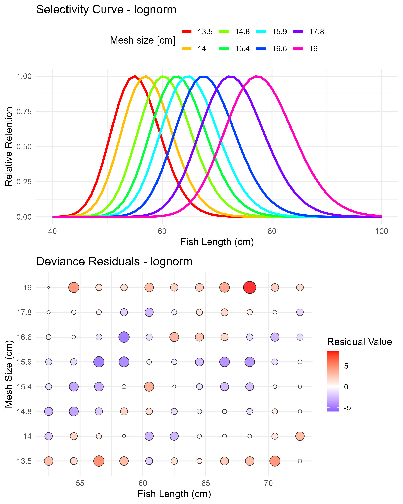
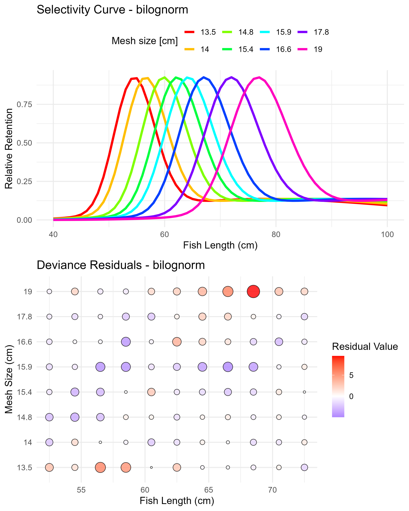
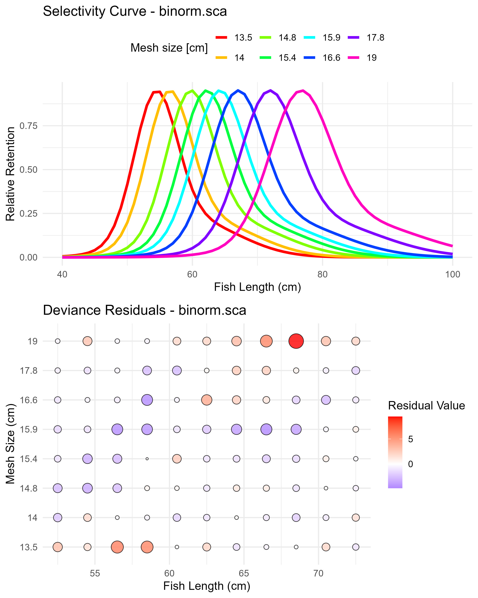

# Examples

## `fit_gillnet_dome` function {#gillnet-selectivity}

This section demonstrates how to use the `fit_gillnet_dome()` function to estimate selectivity parameters for gillnet fisheries. The function fits multiple selectivity models to experimental gillnet data and provides comprehensive model comparison capabilities.

The `fit_gillnet_dome()` function is designed to:

- Fit multiple selectivity curves to gillnet experimental data
- Handle both unimodal and bimodal selectivity patterns
- Provide automatic model comparison and selection
- Generate plots and statistical summaries
- Support both automatic and manual starting value specification

The function expects input data with the following structure:

- Length measurements or frequency data from experimental gillnet fishing
- Multiple mesh sizes tested simultaneously
- Data organized in a format compatible with the package's data processing functions

Loading the package and data:

```{r setup-gillnet, eval=TRUE, echo=TRUE}
# Load the package
library(fishLengthAssess)

# Load the example gillnet data
data("raw_data_gillnet")
input_data <- raw_data_gillnet
input_data

# Define the mesh sizes (cm) used in the experiment
mesh_sizes <- c(13.5, 14.0, 14.8, 15.4, 15.9, 16.6, 17.8, 19)

```

### Example 1 

#### Fitting unimodal models only

In many cases, the user may want to start with simpler unimodal selectivity models before considering more complex bimodal patterns. Setting `run_bimodal = FALSE` fits only the three basic dome-shaped models (i.e., `norm.loc`: Normal common spread, `norm.sca`: Normal scaled spread, and `lognorm`: Lognormal).

```{r unimodal-models, eval=TRUE, echo=TRUE, fig.show='hide', message=FALSE, results='hide'}
# Fit unimodal selectivity models only
result_unimodal <- fit_gillnet_dome(
  input_data = input_data,
  mesh_sizes = mesh_sizes,
  run_bimodal = FALSE,
  output_dir = "model_plots_unimodal",
  length_seq = seq(40, 100, 1)
)
```


The function automatically generates plots for each fitted selectivity model and saves them in the specified output directory (e.g., `model_plots_unimodal`).

```{r normal-loc-example, fig.width=8, fig.height=10, echo=FALSE, out.width="60%",fig.cap="Normal location model (norm.loc) selectivity curves and residuals. The top panel shows the selectivity curves for each mesh size, while the bottom panel displays the deviance residuals."}
# Display the normal location model plot if available
if(file.exists("model_plots_unimodal/Combined_norm.loc.jpeg")) {
  knitr::include_graphics("model_plots_unimodal/Combined_norm.loc.jpeg")
}
```


```{r normal-sca-example, fig.width=8, fig.height=10, echo=FALSE, out.width="60%",fig.cap="Normal scaled spread model (norm.sca) selectivity curves and residuals. The top panel shows the selectivity curves for each mesh size, while the bottom panel displays the deviance residuals."}
# Display the normal scaled spread model plot if available
if(file.exists("model_plots_unimodal/Combined_norm.sca.jpeg")) {
  knitr::include_graphics("model_plots_unimodal/Combined_norm.sca.jpeg")
}
```


```{r normal-lognorm-example, fig.width=8, fig.height=10, echo=FALSE, out.width="60%",fig.cap="Lognormal model (lognorm) selectivity curves and residuals. The top panel shows the selectivity curves for each mesh size, while the bottom panel displays the deviance residuals."}
# Display the normal scaled spread model plot if available
if(file.exists("model_plots_unimodal/Combined_lognorm.jpeg")) {
  
}
```


The function returns a comprehensive list object with results for each fitted model. The user can access the objects using the `$` symbol, as follows:

```{r explore-unimodal, eval=TRUE, echo=TRUE}
# Available model results
names(result_unimodal$results)

# Parameter estimates for Normal Location model
print(result_unimodal$results$norm.loc$estimates)

# Parameter estimates for Normal Scale model
print(result_unimodal$results$norm.sca$estimates)

# Parameter estimates for Lognormal model
print(result_unimodal$results$lognorm$estimates)
```

Here is an example of how to access the selection ogive (for all mesh sizes) for the `norm.loc` model.

```{r show-selection-ogive, eval=TRUE, echo=TRUE}
# Selection ogive matrix (selectivity by length and mesh size)
print("Selection Ogive Matrix (first 10 rows):")
print(head(result_unimodal$results$norm.loc$selection_ogive_mat, 10))
```


#### Extracting mesh-specific selectivity

The user can extract selectivity curves for specific mesh sizes:

```{r mesh-specific, eval=TRUE, echo=TRUE}
# Extract selectivity for mesh size 17.8 cm (Normal Location model)
mesh_17_8 <- result_unimodal$selectivity_curves$norm.loc[, c("Length", "17.8")]

# Display first 10 rows
print("Selectivity for 17.8 cm mesh (Normal Location model):")
print(head(mesh_17_8, 20))

# Extract selectivity for mesh size 15.9 cm (Normal common spread model)
mesh_15_9 <- result_unimodal$selectivity_curves$norm.sca[, c("Length", "15.9")]

# Display first 10 rows
print("Selectivity for 15.9 cm mesh (Normal common spread model):")
print(head(mesh_15_9, 20))
```


#### Calculating aggregated selectivity
Use `get_composite_curve()` to calculate the combined selectivity across all mesh sizes. The following example shows how to get the aggregated selectivity for the Normal Location model (`norm.loc`). 

```{r aggregated-selectivity1, eval=TRUE, echo=TRUE}
# Calculate aggregated selectivity curve
aggregated_selectivity <- get_composite_curve(
  result_unimodal$results$norm.loc, 
  length_seq = seq(40, 100, 1)
)

# Display first 10 values
print("Aggregated selectivity curve (first 10 values):")
print(head(aggregated_selectivity, 10))
```

#### Plotting mesh-specific and aggregated selectivity curves

Use `plot_mesh_curves()` to create plots. The following example shows how to plot selectivity for the Normal Location model (`norm.loc`).

```{r plot-mesh-curves1, eval=TRUE, echo=TRUE, fig.cap="Mesh-specific and composite selectivity curves", fig.width=10, fig.height=6}
# Plot selectivity curves for each mesh size
plot_mesh_curves(
  result_unimodal, 
  "norm.loc",
  length_seq = seq(40, 100, 1),
  save_plot = TRUE,
  output_dir = "model_plots_unimodal"
)
```

#### Comparing unimodal models

Use the `compare_stats` function to generate a comprehensive comparison table. This function allows the user to save a CSV file with the outputs.

```{r compare-unimodal, eval=TRUE, echo=TRUE}
# Generate comparison table for unimodal models
comparison_unimodal <- compare_stats(
  result_unimodal,
  include_bimodal = FALSE,
  save_csv = TRUE, 
  filename = "model_plots_unimodal/unimodal_models_comparison.csv"
)
```

```{r comparison-table-example, echo=FALSE, message=FALSE}
# Display an example summary table if available
if(file.exists("model_plots_unimodal/unimodal_models_comparison.csv")) {
  summary_example <- read.csv("model_plots_unimodal/unimodal_models_comparison.csv")
  knitr::kable(summary_example, 
               caption = "Comparison of unimodal selectivity models",
               digits = 2)
}
```


### Example 2

#### Fitting all models, including bimodals models

For more complex selectivity patterns, include bimodal models (`binorm.sca`: Bi-normal model and `bilognorm`: Bi-lognormal) by setting `run_bimodal = TRUE`. This fits all five available selectivity models using automatic starting values.

```{r all-models-auto, eval=TRUE, echo=TRUE, fig.show='hide', message=FALSE, results='hide'}
# Fit all selectivity models
result_all_auto <- fit_gillnet_dome(
  input_data = input_data,
  mesh_sizes = mesh_sizes,
  run_bimodal = TRUE,
  output_dir = "model_plots_all_auto",
  length_seq = seq(40, 100, 1)
)
```

The function automatically generates plots for each fitted selectivity model and saves them in the specified output directory (e.g., `model_plots_all_auto`).


```{r binormsca-example1, fig.width=8, fig.height=10, echo=FALSE, out.width="60%",fig.cap="Binormal sca (binorm.sca) selectivity curves and residuals. The top panel shows the selectivity curves for each mesh size, while the bottom panel displays the deviance residuals."}
# Display the normal location model plot if available
if(file.exists("model_plots_all_auto/Combined_binorm.sca.jpeg")) {
  knitr::include_graphics("model_plots_all_auto/Combined_binorm.sca.jpeg")
}
```

```{r bilognorm-example1, fig.width=8, fig.height=10, echo=FALSE, out.width="60%",fig.cap="Bilognormal model (bilognorm) selectivity curves and residuals. The top panel shows the selectivity curves for each mesh size, while the bottom panel displays the deviance residuals."}
# Display the normal scaled spread model plot if available
if(file.exists("model_plots_all_auto/Combined_bilognorm.jpeg")) {
  
}
```

The function returns a comprehensive list object with results for each fitted model. The user can access the objects using the $ symbol, as follows:

```{r explore-biimodal1, eval=TRUE, echo=TRUE}
# Available model results
names(result_all_auto$results)

# Parameter estimates for binorm.sca model
print(result_all_auto$results$binorm.sca$estimates)

# Parameter estimates for bilognorm model
print(result_all_auto$results$bilognorm$estimates)
```

Here is an example of how to access the selection ogive (for all mesh sizes) for the `binorm` and `bilognorm` models.

```{r show-selection-ogive-binorm, eval=TRUE, echo=TRUE}
# Selection ogive matrix (selectivity by length and mesh size)
print("Selection Ogive Matrix (first 10 rows):")
print(head(result_all_auto$results$binorm.sca$selection_ogive_mat, 10))
```


```{r show-selection-ogive-bilog, eval=TRUE, echo=TRUE}
# Selection ogive matrix (selectivity by length and mesh size)
print("Selection Ogive Matrix (first 10 rows):")
print(head(result_all_auto$results$bilognorm$selection_ogive_mat, 10))
```

#### Extracting mesh-specific selectivity

The user can extract selectivity curves for specific mesh sizes:

```{r mesh-specific2, eval=TRUE, echo=TRUE}
# Extract selectivity for mesh size 14.8 cm (binorm.sca model)
mesh_14_8 <- result_all_auto$selectivity_curves$binorm.sca[, c("Length", "14.8")]

# Display first 10 rows
print("Selectivity for 14.8 cm mesh (binorm.sca model):")
print(head(mesh_14_8, 20))

# Extract selectivity for mesh size 16.6 cm (bilognorm model)
mesh_16_6 <- result_all_auto$selectivity_curves$bilognorm[, c("Length", "16.6")]

# Display first 10 rows
print("Selectivity for 16.6 cm mesh (bilognorm model):")
print(head(mesh_16_6, 20))
```


#### Calculating aggregated selectivity

Use `get_composite_curve()` to calculate the combined selectivity across all mesh sizes. The following example shows how to get the aggregated selectivity for the Bi-normal model (`binorm.sca`).

```{r aggregated-selectivity2, eval=TRUE, echo=TRUE}
# Calculate aggregated selectivity curve
aggregated_selectivity <- get_composite_curve(
  result_all_auto$results$binorm.sca, 
  length_seq = seq(40, 100, 1)
)

# Display first 10 values
print("Aggregated selectivity curve (first 10 values):")
print(head(aggregated_selectivity, 10))
```

#### Plotting mesh-specific and aggregated selectivity curves

Use `plot_mesh_curves()` to create plots. The following example shows how to plot selectivity for the  Bi-normal model (`binorm.sca`).

```{r plot-mesh-curves2, eval=TRUE, echo=TRUE, fig.cap="Mesh-specific and composite selectivity curves", fig.width=10, fig.height=6}
# Plot selectivity curves for each mesh size
plot_mesh_curves(
  result_all_auto, 
  "binorm.sca",
  length_seq = seq(40, 100, 1),
  save_plot = TRUE,
  output_dir = "model_plots_all_auto"
)
```

#### Comparing all models

Use the `compare_stats` function to generate a comprehensive comparison table. This function allows the user to save a CSV file with the outputs.

```{r compare-all2, eval=TRUE, echo=TRUE}
# Generate comparison table for unimodal models
comparison_all_auto <- compare_stats(
  result_all_auto,
  include_bimodal = TRUE,
  save_csv = TRUE, 
  filename = "model_plots_all_auto/all_models_comparison.csv"
)
```


```{r all-model-comparison2, echo=FALSE, message=FALSE}
if (file.exists("model_plots_all_auto/all_models_comparison.csv")) {
  summary_example <- read.csv("model_plots_all_auto/all_models_comparison.csv", stringsAsFactors = FALSE)
  colnames(summary_example) <- gsub("\\.", " ", colnames(summary_example))
  colnames(summary_example) <- gsub("\\s+", " ", colnames(summary_example))
  colnames(summary_example) <- gsub("\\s*\\(cm\\)\\s*", " (cm)", colnames(summary_example))
  knitr::kable(summary_example,
               caption = "Comparison of all selectivity models",
               digits = 2)
}
```

### Example 3

#### Fitting all models, including bimodals with manual starting values

For better control over the optimization process, especially with bimodal models  (`binorm.sca``: Bi-normal model and `bilognorm`: Bi-lognormal), the user can specify manual starting values:

```{r manual-starting-values, eval=TRUE, echo=TRUE, fig.show='hide', message=FALSE, results='hide'}
# Define manual starting values for bimodal models
manual_starts <- list(
  binorm.sca = c(55, 4, 65, 4, 3),     # Mode1, SD1, Mode2, SD2, logit(P1)
  bilognorm = c(4, 0.2, 4.2, 0.1, 2)  # log(mu1), log(sigma1), log(mu2), log(sigma2), logit(P1)
)
# Fit models with manual starting values
result_all_manual <- fit_gillnet_dome(
  input_data = input_data,
  mesh_sizes = mesh_sizes,
  manual_x0_list = manual_starts,
  run_bimodal = TRUE,
  output_dir = "model_plots_all_manual",
  length_seq = seq(40, 100, 1)
)

```

The function automatically generates plots for each fitted selectivity model and saves them in the specified output directory (e.g., `model_plots_all_manual`).

```{r binormsca-example3, fig.width=8, fig.height=10, echo=FALSE, out.width="60%",fig.cap="Binormal sca (binorm.sca) selectivity curves and residuals. The top panel shows the selectivity curves for each mesh size, while the bottom panel displays the deviance residuals."}
# Display the normal location model plot if available
if(file.exists("model_plots_all_manual/Combined_binorm.sca.jpeg")) {
  
}
```

```{r bilognorm-example3, fig.width=8, fig.height=10, echo=FALSE, out.width="60%",fig.cap="Bilognormal model (bilognorm) selectivity curves and residuals. The top panel shows the selectivity curves for each mesh size, while the bottom panel displays the deviance residuals."}
# Display the normal scaled spread model plot if available
if(file.exists("model_plots_all_manual/Combined_bilognorm.jpeg")) {
  knitr::include_graphics("model_plots_all_manual/Combined_bilognorm.jpeg")
}
```

The function returns a comprehensive list object with results for each fitted model. The user can access the objects using the $ symbol, as follows:

```{r explore-biimodal3, eval=TRUE, echo=TRUE}
# Available model results
names(result_all_manual$results)

# Parameter estimates for binorm.sca model
print(result_all_manual$results$binorm.sca$estimates)

# Parameter estimates for bilognorm model
print(result_all_manual$results$bilognorm$estimates)
```

Here is an example of how to access the selection ogive (for all mesh sizes) for the `binorm` and `bilognorm` models (models fitted using manual starting values).

```{r show-selection-ogive-binorm3, eval=TRUE, echo=TRUE}
# Selection ogive matrix (selectivity by length and mesh size)
print("Selection Ogive Matrix (first 10 rows):")
print(head(result_all_manual$results$binorm.sca$selection_ogive_mat, 10))
```


```{r show-selection-ogive-bilog3, eval=TRUE, echo=TRUE}
# Selection ogive matrix (selectivity by length and mesh size)
print("Selection Ogive Matrix (first 10 rows):")
print(head(result_all_manual$results$bilognorm$selection_ogive_mat, 10))
```

#### Extracting Mesh-Specific Selectivity

The user can extract selectivity curves for specific mesh sizes:

```{r mesh-specific3, eval=TRUE, echo=TRUE}
# Extract selectivity for mesh size 14.8 cm (binorm.sca model)
mesh_14_8 <- result_all_manual$selectivity_curves$binorm.sca[, c("Length", "14.8")]

# Display first 10 rows
print("Selectivity for 14.8cm mesh (binorm.sca model):")
print(head(mesh_14_8, 10))

# Extract selectivity for mesh size 16.6 cm (bilognorm model)
mesh_16_6 <- result_all_manual$selectivity_curves$bilognorm[, c("Length", "16.6")]

# Display first 10 rows
print("Selectivity for 16.6cm mesh (bilognorm model):")
print(head(mesh_16_6, 10))
```

#### Calculating aggregated selectivity

The user can use `get_composite_curve()` to calculate the combined selectivity across all mesh sizes. The following example shows how to get the aggregated selectivity for the Bi-lognormal model (bilognorm).


```{r aggregated-selectivity3, eval=TRUE, echo=TRUE}
# Calculate aggregated selectivity curve
aggregated_selectivity <- get_composite_curve(
  result_all_manual$results$bilognorm, 
  length_seq = seq(40, 100, 1)
)

# Display first 10 values
print("Aggregated selectivity curve (first 10 values):")
print(head(aggregated_selectivity, 10))
```

#### Plotting mesh-specific and aggregated selectivity curves

Use `plot_mesh_curves()` to create plots. The following example shows how to plot selectivity for the Bi-normal model (binorm.sca).

```{r plot-mesh-curves3, eval=TRUE, echo=TRUE, fig.cap="Mesh-specific selectivity curves", fig.width=10, fig.height=6}
# Plot selectivity curves for each mesh size
plot_mesh_curves(
  result_all_manual, 
  "binorm.sca",
  length_seq = seq(40, 100, 1),
  save_plot = TRUE,
  output_dir = "model_plots_all_manual"
)
```

#### Comparing all models
As before, the user can use `compare_stats()` function to generate a comprehensive comparison table. This function allows the user to save a CSV file with the outputs.


```{r compare-all-manual3, eval=TRUE, echo=TRUE}
# Generate comparison table for unimodal models
comparison_all_manual <- compare_stats(
  result_all_manual,
  include_bimodal = TRUE,
  save_csv = TRUE, 
  filename = "model_plots_all_manual/all_models_comparison.csv"
)
```


```{r all-model-comparison-manual3, echo=FALSE, message=FALSE}
if (file.exists("model_plots_all_manual/all_models_comparison.csv")) {
  summary_example <- read.csv("model_plots_all_manual/all_models_comparison.csv", stringsAsFactors = FALSE)
  colnames(summary_example) <- gsub("\\.", " ", colnames(summary_example))
  colnames(summary_example) <- gsub("\\s+", " ", colnames(summary_example))
  colnames(summary_example) <- gsub("\\s*\\(cm\\)\\s*", " (cm)", colnames(summary_example))
  knitr::kable(summary_example,
               caption = "Comparison of all selectivity models",
               digits = 2)
}
```


## `GTGDomeLBSPRSim2` function {#dome-shaped-lbspr}

### Practical Application of GTG Length-Based SPR model including dome-shaped selectivity: Step-by-Step Example

This example demonstrates how to perform a dome-shaped length-based spawning potential ratio (LBSPR) simulation using the Growth-Type Group model with support for dome-shaped gillnet selectivity curves.
This example demonstrates how to set up the `lengthComp` object, create the `LifeHistoryObj`, define selectivity models, run simulations, estimate parameters from length data, and visualize results.

The example code presented here was adapted from the original implementation (https://github.com/KHommik/DomeShaped_GTG_LBSPR) by @hommik2020, with modifications to accommodate additional selectivity models and updated simulation routines.

#### Step 1. Setting Up the Environment

Load the required packages and data:

```{r setup-packages-lbspr, eval=TRUE, echo=TRUE}
library(fishLengthAssess)
library(fishSimGTG)

# Load the example gillnet data
data("raw_data_gillnet")
input_data <- raw_data_gillnet
input_data

# Define the mesh sizes (cm) used in the experiment
mesh_sizes <- c(13.5, 14.0, 14.8, 15.4, 15.9, 16.6, 17.8, 19)

# Load the example of catch at length data
data("gtg_catch_frequency") # it contains frequency
data("gtg_catch_lengths")   # it contains lengths

# In this example we will use frequency data
sampleCatch <- gtg_catch_frequency
#sampleCatch <- gtg_catch_lengths  # Uncomment this line if you want to use length data
```

#### Step 2. Create the `lengthComp` object

Set up the characteristics of the data:

```{r setup-lengthComp, eval=TRUE, echo=TRUE}
lengthComp <- new("LengthComp")
lengthComp@dataType <- "Frequency"  # "Length" or "Frequency" - the users need to choose one.
lengthComp@L_source <- "FD"
lengthComp@dt <- sampleCatch
lengthComp@L_units <- "cm"
lengthComp@L_type <- "TL"
lengthComp@header <-TRUE
lengthComp@observationGroup <- "Catch" #for Frequency or "Year" for Length (choose the right one)
```

**Note:** 
If `sampleCatch <- gtg_catch_frequency` then set `lengthComp@dataType <- "Frequency"` and `lengthComp@observationGroup <- "Catch"`

If `sampleCatch <- gtg_catch_lengths` then set `lengthComp@dataType <- "Length"` and `lengthComp@observationGroup <- "Year"`

#### Step 3. Create the `LifeHistoryObj` object

Set up the stock's biological parameters using direct slot assignment:

```{r life-history-parameters, eval=TRUE, echo=TRUE}
LifeHistoryObj <- new("LifeHistory")
LifeHistoryObj@title <- "Fish Stock"
LifeHistoryObj@speciesName <- "Generic Fish"
LifeHistoryObj@shortDescription <- "Stock for dome shaped LBSPR Analysis"
LifeHistoryObj@L_type <- "TL"
LifeHistoryObj@L_units <- "cm"
LifeHistoryObj@Walpha_units <- "g"

LifeHistoryObj@Linf <- 120
LifeHistoryObj@K <- 0.2  
LifeHistoryObj@t0 <- 0
LifeHistoryObj@L50 <- 60
LifeHistoryObj@L95delta <- 2  # L95 - L50 = 62 - 60
LifeHistoryObj@M <- 0.3  # Calculated from MK * K = 1.5 * 0.2
LifeHistoryObj@MK <- 1.5  

LifeHistoryObj@LW_A <- 0.01
LifeHistoryObj@LW_B <- 3
LifeHistoryObj@Steep <- 0.7
LifeHistoryObj@R0 <- 1E6
LifeHistoryObj@Tmax <- -log(0.01) / LifeHistoryObj@M

LifeHistoryObj@recSD <- 0.6
LifeHistoryObj@recRho <- 0
LifeHistoryObj@isHermaph <- FALSE
LifeHistoryObj@H50 <- 0
LifeHistoryObj@H95delta <- 0

# GTG-specific parameters as attributes
attr(LifeHistoryObj, "CVLinf") <- 0.1
attr(LifeHistoryObj, "MaxSD") <- 2
attr(LifeHistoryObj, "NGTG") <- 13
attr(LifeHistoryObj, "Mpow") <- 0
attr(LifeHistoryObj, "FecB") <- 3
```


#### Step 4. Setting up size bins

Define length bins for the analysis:

```{r length-bins, eval=TRUE, echo=TRUE}
lengthBinWidth <- 1
SizeBins <- list()
SizeBins$Linc <- lengthBinWidth
SDLinf <- attr(LifeHistoryObj, "CVLinf") * LifeHistoryObj@Linf
SizeBins$ToSize <- LifeHistoryObj@Linf + SDLinf * attr(LifeHistoryObj, "MaxSD")
LenBins <- seq(from = 0, to = SizeBins$ToSize, by = SizeBins$Linc)
LenMids <- seq(from=0.5*SizeBins$Linc, by=SizeBins$Linc,length.out=(length(LenBins)-1))
lengthFish <- seq(from=0.5*SizeBins$Linc, by=SizeBins$Linc,length.out=length(LenBins) - 1)
```

#### Step 5. Fitting selectivity curves to gillnet data

If gillnet selectivity data are available, the `fit_gillnet_dome()` function can be used to fit a variety of dome-shaped selectivity models to these data. This function is described in detail in \@ref(gillnet-fitting) and allows users to estimate selectivity curves such as normal, lognormal, and bimodal types.

In this section, we apply `fit_gillnet_dome()` to example gillnet data from @millar1997 to obtain fitted selectivity curves that can later be compared with those used in simulation.

```{r fit-gillnet-sel, eval=TRUE, echo=TRUE, results='hide', fig.show='hide',message=FALSE}
selfit <- fit_gillnet_dome(
  input_data = input_data,
  mesh_sizes = mesh_sizes,
  output_dir = "fig_dome_lbspr",
  length_seq = lengthFish,
  run_bimodal = FALSE  # Set to TRUE to include bimodal models
# Note: If in fit_gillnet_dome(), run_bimodal=FALSE: "Normal.loc", "Normal.sca", "logNorm"
# Note: If in fit_gillnet_dome(), run_bimodal=TRUE: All the above plus "binorm.sca", "bilognorm
)

```

We are plotting here the `norm.sca`: Normal scaled spread selectivity model

```{r include-plot-dome-lbspr, echo=FALSE, fig.cap="Gillnet selectivity estimation and model residuals.", out.width="70%"}
knitr::include_graphics("fig_dome_lbspr/Combined_norm.sca.jpeg") 
```

#### Step 6. Defining fleet parameters

The next step is to define a list named `FleetPars` that contains the fishery parameters.

```{r fleet parameters, eval=TRUE, echo=TRUE}
FleetPars <- NULL
FleetPars$FM <- 1
```

The user can choose from several selectivity options by commenting and uncommneting a block of code.

This example is based on `FleetPars$selectivityCurve <- "Normal.sca"`

Choose one of the selectivity curve options below by uncommenting the desired block and commenting out all others.

If `FleetPars$use_aggregated <- FALSE`, then `FleetPars$fishery_mesh` must be assigned a specific mesh size. For example, to retrieve the `"Normal.sca"` selectivity curve for mesh size 14, use `FleetPars$fishery_mesh <- 14`.


```{r fleet-parameters-selectivity-options, eval=TRUE, echo=TRUE}
# Option 0. logistic
# FleetPars$selectivityCurve <- "Logistic"
# FleetPars$SL1 = 50
# FleetPars$SL2 = 80

# Option 1. Normal Location (normal with fixed spread)
# FleetPars$selectivityCurve <- "Normal.loc"
# FleetPars$SL1 <- selfit$results$norm.loc$par[1]
# FleetPars$SL2 <- selfit$results$norm.loc$par[2]
# FleetPars$SLmesh <- mesh_sizes
# FleetPars$SLMin <- NA
# FleetPars$use_aggregated <- TRUE
#FleetPars$fishery_mesh <- 14

# Option 2. Normal.sca (normal with proportional spread)
FleetPars$selectivityCurve <- "Normal.sca"
FleetPars$SL1 <- selfit$results$norm.sca$par[1]
FleetPars$SL2 <- selfit$results$norm.sca$par[2]^2
FleetPars$SLmesh <- mesh_sizes
FleetPars$SLMin <- NA
FleetPars$use_aggregated <- TRUE
# FleetPars$fishery_mesh <- 14

# Option 3. logNorm
# FleetPars$selectivityCurve <- "logNorm"
# FleetPars$SL1 <- selfit$results$lognorm$par[1]  
# FleetPars$SL2 <- selfit$results$lognorm$par[2]
# FleetPars$SLmesh <- mesh_sizes
# FleetPars$SLMin <- NA
# FleetPars$use_aggregated <- FALSE
# FleetPars$fishery_mesh <- 14   

# Option 4. binorm.sca
# FleetPars$selectivityCurve <- "binorm.sca"
# FleetPars$SL1 <- selfit$results$binorm.sca$par[1]
# FleetPars$SL2 <- selfit$results$binorm.sca$par[2]
# FleetPars$SL3 <- selfit$results$binorm.sca$par[3]
# FleetPars$SL4 <- selfit$results$binorm.sca$par[4]
# FleetPars$SL5 <- selfit$results$binorm.sca$par[5]
# FleetPars$SLmesh <- mesh_sizes
# FleetPars$SLMin <- NA
# FleetPars$use_aggregated <- FALSE
# FleetPars$fishery_mesh <- 14

# Option 5. bilognorm
# FleetPars$selectivityCurve <- "bilognorm"
# FleetPars$SL1 <- selfit$results$bilognorm$par[1]
# FleetPars$SL2 <- selfit$results$bilognorm$par[2]
# FleetPars$SL3 <- selfit$results$bilognorm$par[3]
# FleetPars$SL4 <- selfit$results$bilognorm$par[4]
# FleetPars$SL5 <- selfit$results$bilognorm$par[5]
# FleetPars$SLmesh <- mesh_sizes
# FleetPars$SLMin <- NA
# FleetPars$use_aggregated <- FALSE
# FleetPars$fishery_mesh <- 14
```

The following lines of code set the gear selectivity variables for use in other parts of the script, create a shorter-named local variable `meshSize` that references the same mesh sizes as `FleetPars$SLmesh` (to make subsequent code more concise), and display the selected curve used to run the GTG dome-shaped LBSPR model.

```{r setting gear-selectivity, eval=TRUE, echo=TRUE}
gearSelectivity <- FleetPars$selectivityCurve
if(!is.null(FleetPars$SLmesh)) meshSize <- FleetPars$SLmesh
cat("Selected selectivity curve:", gearSelectivity, "\n")
```

#### Step 7. Running the simulation for checking purposes

Once the user has defined their `FleetPars`, they can call the `GTGDomeLBSPRSim2()` function to run the simulation. After running the simulation, the user can obtain the selectivity curves and check whether `GTGDomeLBSPRSim2()` reproduces the same curve estimated by the `fit_gillnet_dome()` function.

```{r load GTGLBSPR_Dome, eval=TRUE, echo=TRUE}
sim_output <- GTGDomeLBSPRSim2(LifeHistoryObj, FleetPars, SizeBins)
gearSelLen <- sim_output$SelLen
```


#### Step 8. Visualizing selectivity curves

After fitting dome-shaped selectivity models using `fit_gillnet_dome()`, you can compare the resulting fitted curves with those reconstructed internally by the `GTGDomeLBSPRSim2()` simulation. This step helps verify that the simulation is correctly using the estimated selectivity parameters.

The comparison can be done in two modes:

- Aggregated selectivity (`FleetPars$use_aggregated = TRUE`): This plots the composite selectivity curve (aggregated across mesh sizes) used in the simulation alongside the one estimated by `fit_gillnet_dome()`.

- Mesh-specific selectivity (`FleetPars$use_aggregated = FALSE`). This plots the selectivity curve corresponding to a specific mesh size (as specified in `FleetPars$fishery_mesh`) and compares it to the fitted mesh-specific curve.

Aggregated selectivity curve are obtaining by using the function `get_composite_curve()` included in the R code presented in chapter 5, section \@ref(gillnet-fitting).

**Note**: These comparisons apply only to dome-shaped selectivity models (e.g., normal, log-normal, bimodal). A separate comparison routine for logistic selectivity is provided at the end of this document

```{r model_names, eval=TRUE, echo=TRUE}

# Map model names
model_lookup <- c(
  "Normal.loc"   = "norm.loc",
  "Normal.sca"   = "norm.sca",
  "logNorm"      = "lognorm",
  "binorm.sca"   = "binorm.sca",
  "bilognorm"    = "bilognorm"
)

# Get the selectivity curve name for plotting
sel_model_name <- model_lookup[FleetPars$selectivityCurve]

# Get selectivity curve from simulation output for plotting
gearSelLen <- sim_output$SelLen[1:length(lengthFish)]
```

```{r fig.cap="Comparison of the fitted curves with those reconstructed internally by the GTGDomeLBSPRSim2 simulation"}

# For aggregated selectivity
if (isTRUE(FleetPars$use_aggregated)) {
  # Get fitted model from selfit
  fitted_model <- selfit$results[[sel_model_name]]
  
  # Get the aggregated selectivity curve
  fitted_sel_df <- get_composite_curve(fitted_model, length_seq = lengthFish)
  colnames(fitted_sel_df) <- c("Length", "FittedSelectivity")
  
  # Prepare data for comparison
  internal_sel_df <- data.frame(Length = lengthFish, gearSelLen)
  comparison_df <- merge(internal_sel_df, fitted_sel_df, by = "Length")
  
  # Plot comparison
p1=ggplot(comparison_df, aes(x = Length)) +
    geom_line(aes(y = gearSelLen, color = "GTG gearSelLen"), size = 1.2) +
    geom_line(aes(y = FittedSelectivity, color = "Gillnet fitted"), linetype = "dashed", size = 1.2) +
    geom_vline(aes(xintercept = LifeHistoryObj@L50, color = "L50 = mat 50%"), linetype = "dotted", size = 1) +
    scale_color_manual(values = c("GTG gearSelLen" = "blue", "Gillnet fitted" = "red","L50 = mat 50%" = "grey")) +
    labs(title = paste("Selectivity Comparison -", FleetPars$selectivityCurve),
         x = "Length (cm)", y = "Selectivity", color = "Source") +
    theme_bw()
# specific mesh selectivity exploration
} else if (!is.null(FleetPars$fishery_mesh)) {
  
  mesh_use <- as.character(FleetPars$fishery_mesh)
  fitted_sel_vec <- selfit$selectivity_curves[[sel_model_name]][[mesh_use]]
  
  comparison_df <- data.frame(
    Length = lengthFish,
    internal_sel = gearSelLen,
    fitted_sel = fitted_sel_vec
  )
  
 p1= ggplot(comparison_df, aes(x = Length)) +
    geom_line(aes(y = internal_sel, color = "gearSelLen"), size = 1.2) +
    geom_line(aes(y = fitted_sel, color = "gillnet fitted"), linetype = "dashed", size = 1.2) +
    geom_vline(aes(xintercept = LifeHistoryObj@L50, color = "L50 = mat 50%"), linetype = "dotted", size = 1) +
    scale_color_manual(values = c("gearSelLen" = "blue", "gillnet fitted" = "red","L50 = mat 50%" = "grey")) +
    labs(
      title = paste("Selectivity Comparison (Mesh", mesh_use, "mm)"),
      x = "Length (cm)", y = "Selectivity", color = "Source"
    ) +
    theme_bw()
  
} else {
  stop("Selectivity comparison cannot proceed: either use_aggregated must be TRUE or a mesh size must be provided.")
}
print (p1)
```

#### Step 9. Parameter estimation

To estimate parameters from length-frequency data use the function `run_grouped_and_pooled`.

```{r run-optimization, eval=TRUE, echo=TRUE}
results_all <- run_grouped_and_pooled(LifeHistoryObj, FleetPars, lengthComp, SizeBins, Lc = 0)

# The user can explore the outputs using $ symbol
print(results_all$pooled$lbPars)
print(results_all$pooled$lbStdErrs)
print(results_all$pooled$NLL)
print(results_all$pooled$optimOut$convergence) 

if (!is.null(results_all$grouped$group_results)) {
  lapply(results_all$grouped$group_results, function(x) print(x$lbPars))
}
```

#### Step 10. Visualization

The visualization section provides a diagnostic plot to evaluate model performance. The plots help assess how well the estimated parameters reproduce the observed length composition data and provide insights into the biological realism of the fitted model.

The visualization section automatically adapts to the input data type specified in the `lengthComp` object. For frequency data (`dataType = "Frequency"`), observed counts are calculated by summing across catch columns, using the length bins directly from the data structure. For raw length measurements (`dataType = "Length"`), the individual length observations are converted into frequency distributions using the predefined length bins (`LenBins`) and midpoints (`LenMids`).

```{r run-visualization, eval=TRUE, echo=TRUE}
# Determine data type and prepare accordingly
data_type <- lengthComp@dataType
if (data_type == "Frequency") {
  cat("Using Frequency data plotting approach\n")
  
  # For frequency data - data already has proper structure
  observed_data <- rowSums(sampleCatch[, -1])  # Sum across catch columns (excluding Length column)
  length_vector <- sampleCatch$Length          # Use the length column
  
} else if (data_type == "Length") {
  cat("Using Length data plotting approach\n")
  
  # For raw length data - convert to frequency bins
  observed_data <- hist(unlist(sampleCatch), breaks = LenBins, plot = FALSE)$counts
  length_vector <- LenMids  # Use bin midpoints
  
} else {
  stop("Unknown data type: ", data_type)
}

# Get predicted data from optimization results
predicted_data <- results_all$pooled$PredLen

# Create comparison dataframe
compare_df <- data.frame(
  Length = length_vector,
  Observed = observed_data,
  Predicted = predicted_data
)
```

The following plot compares the observed length composition against the model's predicted values during the parameter estimation process. This plot is helpful to demonstrate how well the optimizer was able to fit the model to the data during the likelihood maximization.

```{r fig.cap="Observed vs Predicted Length Composition"}
# Basic comparison of observed vs predicted during optimization
p_basic <- ggplot(compare_df, aes(x = Length)) +
  geom_bar(aes(y = Observed), stat = "identity", fill = "grey", alpha = 0.7) +
  geom_line(aes(y = Predicted), color = "red", size = 1.2) +
  theme_bw() +
  labs(title = paste("Observed vs Predicted Length Composition (", data_type, "data)"),
       x = "Length (cm)", y = "Counts")

print(p_basic)
```

#### Step 11. Model re-simulation setup

After parameter estimation, the code reconstructs a clean `FleetPars` object containing the estimated fishing mortality `(F/M)` ratio and selectivity parameters.

```{r re-simulation, eval=TRUE, echo=TRUE} 
# Extract pooled optimization results
testOpt <- results_all$pooled

# Create clean FleetPars object with estimated parameters
FleetPars <- list(FM = testOpt$lbPars[["F/M"]], 
                        selectivityCurve = testOpt$fixedFleetPars$selectivityCurve)

# Preserve fleet-specific parameters from original optimization
# These lines ensure that extra fields used during selectivity modeling (like mesh sizes or whether aggregation is FALSE or TRUE are preserved
if (!is.null(testOpt$fixedFleetPars$SLmesh)) FleetPars$SLmesh <- testOpt$fixedFleetPars$SLmesh
if (!is.null(testOpt$fixedFleetPars$SLMin)) FleetPars$SLMin <- testOpt$fixedFleetPars$SLMin
if (!is.null(testOpt$fixedFleetPars$use_aggregated)) FleetPars$use_aggregated <- testOpt$fixedFleetPars$use_aggregated
if (!is.null(testOpt$fixedFleetPars$fishery_mesh)) FleetPars$fishery_mesh <- testOpt$fixedFleetPars$fishery_mesh


# Insert the appropiate selectivity parameters - handle specific selectivity curve parameters
if (testOpt$fixedFleetPars$selectivityCurve == "Logistic") {                  
  # For Logistic, parameters might be estimated
  FleetPars$SL1 <- ifelse("SL50" %in% names(testOpt$lbPars), testOpt$lbPars[["SL50"]], testOpt$fixedFleetPars[["SL1"]])
  FleetPars$SL2 <- ifelse("SL95" %in% names(testOpt$lbPars), testOpt$lbPars[["SL95"]], testOpt$fixedFleetPars[["SL2"]])
} else if (testOpt$fixedFleetPars$selectivityCurve == "Knife") {
  FleetPars$MLLKnife <- testOpt$fixedFleetPars$MLLKnife 
} else if (testOpt$fixedFleetPars$selectivityCurve %in% c("binorm.sca", "bilognorm")) {
  # For new dome-shaped curves with 5 parameters
  FleetPars$SL1 <- testOpt$fixedFleetPars$SL1
  FleetPars$SL2 <- testOpt$fixedFleetPars$SL2
  FleetPars$SL3 <- testOpt$fixedFleetPars$SL3
  FleetPars$SL4 <- testOpt$fixedFleetPars$SL4
  FleetPars$SL5 <- testOpt$fixedFleetPars$SL5
} else {
  # For other curves (Normal.sca, Normal.loc, logNorm)
  FleetPars$SL1 <- testOpt$fixedFleetPars$SL1
  FleetPars$SL2 <- testOpt$fixedFleetPars$SL2
}
```

The next code re-run the GTG simulation using the estimated parameters. This generates a fresh simulation of the expected equilibrium catch-per-recruit distribution, which is then scaled to match the magnitude of the observed data.
The generated plot shows whether the estimated parameters, when used in an independent simulation, can reproduce realistic catch distributions that match the observed data patterns.


```{r fig.cap="Observed vs GTG Re-simulation"}
# This part does the per-recruit simulation using the fitted fishing mortality and selectivity parameters, and then summarizes the expected catch per recruit.                 
 prSim <- GTGDomeLBSPRSim2(LifeHistoryObj, FleetPars, SizeBins)
 sum(prSim$LCatchFished)
 
 
 # Scale predicted to match observed range
 scaled_pred <- max(observed_data) * prSim$LCatchFished / max(prSim$LCatchFished)
 
 # Create validation comparison plot
 p2 <- ggplot(data.frame(Length = length_vector, Observed = observed_data)) +
   geom_col(aes(x = Length, y = Observed), fill = "grey50") +
   geom_line(data = data.frame(Length = LenMids, Predicted = scaled_pred),
             aes(x = Length, y = Predicted), color = "red", size = 1.5) +
   theme_bw() +
   labs(
     x = "Length (cm)",
     y = "Catch in Number",
     title = paste("Observed vs GTG Re-simulation (", data_type, "data)")
   )
 
 print(p2)

```

The final plot provides a refined presentation of the optimization fit with improved formatting and clear legend distinction between observed and predicted values.

```{r fig.cap="Final model fit"}
p3 <- ggplot(compare_df, aes(x = Length)) +
   geom_bar(aes(y = Observed, fill = "Observed"), stat = "identity", alpha = 0.6) +
   geom_line(aes(y = Predicted, color = "Predicted"), size = 1.2) +
   scale_fill_manual(values = c("Observed" = "gray")) +
   scale_color_manual(values = c("Predicted" = "red")) +
   labs(title = paste("Model Fit Comparison (", data_type, "data)"),
        x = "Length (cm)", y = "Counts", fill = "", color = "") +
   theme_bw()
 
 print(p3)
```

#### Step 12. Sensitivity analysis: Multiple life history parameter combinations

This section demonstrates how to conduct a comprehensive sensitivity analysis by running the dome-shaped LBSPR model across multiple combinations of key life history parameters. 
The sensitivity analysis examines the response of the model to variations in two critical life history parameters: M/K ratio and asymptotic length

```{r sensitivity, eval=TRUE, echo=TRUE}
# Conducting the Dome-shaped LB-SPR: apply to multiple M/K and Linf values
# Define parameter sequences for sensitivity analysis
MKseq <- c(1.5, 1.8, 2.0)     # M/K ratios to test
Linfseq <- c(90, 100, 120)    # asymptotic lengths to test (cm)

# Initialize storage for results
results_list <- list()
row_labels <- c()
combo_id <- 1    # counter for parameter combinations
```

The analysis uses a loop structure to systematically evaluate all possible combinations of the specified parameter values. For each combination, the model creates a temporary copy of the life history object with updated parameters and runs the optimization routine using the `DoOptDome.aggregated()` function. This sensitivity analysis employs `DoOptDome.aggregated()`, which is a convenience wrapper function that automatically pools (aggregates) multiple groups before optimization. This approach differs from the `run_grouped_and_pooled()` function used in the previous step, which can perform both grouped and pooled analyses. The `DoOptDome.aggregated()` function simplifies the workflow for sensitivity analyses where only pooled results are needed across parameter combinations.

```{r sensitivity-loop, eval=TRUE, echo=TRUE}

# Systematic evaluation of parameter combinations
for (iLinf in seq_along(Linfseq)) {
  for (iMK in seq_along(MKseq)) {
    
    # Create temporary life history object with updated parameters
    LifeHistoryObj_temp <- LifeHistoryObj
    LifeHistoryObj_temp@Linf <- Linfseq[iLinf]
    LifeHistoryObj_temp@MK <- MKseq[iMK]
    LifeHistoryObj_temp@M <- MKseq[iMK] * LifeHistoryObj_temp@K  # Update M accordingly
# Run optimization for current parameter combination using DoOptDome.aggregated()
# DoOptDome.aggregated() is a convenience wrapper that pools all groups before optimization
    runOpt <- DoOptDome.aggregated(LifeHistoryObj_temp, FleetPars,
                                   lengthComp,
                                   SizeBins = SizeBins, Lc = 0, mod = "GTG")
    
    # Extract key results
    fm  <- runOpt$lbPars["F/M"]      # Fishing mortality ratio
    spr <- runOpt$lbPars["SPR"]      # Spawning potential ratio
    nll <- runOpt$NLL                # Negative log-likelihood
    
    # Calculate confidence intervals when standard errors are available
    if (!is.null(runOpt$lbStdErrs) && "F/M" %in% names(runOpt$lbStdErrs)) {
      fm_se <- runOpt$lbStdErrs["F/M"]
      fm_lower <- fm - 1.96 * fm_se   # 95% confidence interval
      fm_upper <- fm + 1.96 * fm_se
    } else {
      fm_se <- NA
      fm_lower <- NA
      fm_upper <- NA
      warning(paste("F/M SE not available for Linf =", Linfseq[iLinf],
                    "and MK =", MKseq[iMK]))
    }
    
    # Store results for current combination
    result_row <- data.frame(
      MK = MKseq[iMK],
      Linf = Linfseq[iLinf],
      `F/M` = fm,
      `F/M_SE` = fm_se,
      SPR = spr,
      NLL = nll,
      F_M_Lower = fm_lower,
      F_M_Upper = fm_upper,
      stringsAsFactors = FALSE
    )
    
    results_list[[combo_id]] <- result_row
    row_labels <- c(row_labels, paste0("combination_", combo_id))
    combo_id <- combo_id + 1
    
    # Progress reporting
    cat(paste("Completed: Linf =", Linfseq[iLinf], ", MK =", MKseq[iMK], 
              ", F/M =", round(fm, 4), ", SPR =", round(spr, 4), "\n"))
  }
}    
```

After completing all parameter combinations, the results are compiled into a data frame and formatted for a table.

```{r sensitivity-summary, eval=TRUE, echo=TRUE}
# Final data frame
results_df <- do.call(rbind, results_list)
rownames(results_df) <- row_labels

# View it
print(results_df)

# Create a table for visualization purposes
# Clean up column names and remove duplicates
# Create a clean table with proper column order and names
visual_table <- data.frame(
  MK = results_df$MK,
  Linf = results_df$Linf,
  `F/M` = round(as.numeric(results_df$F.M), 3),
  `F/M_SE` = round(as.numeric(results_df$F.M_SE), 3),
  `F/M_Lower` = round(results_df$F_M_Lower, 3),
  `F/M_Upper` = round(results_df$F_M_Upper, 3),
  SPR = round(results_df$SPR, 3),
  NLL = round(results_df$NLL, 2),
  check.names = FALSE  # This preserves the "/" in column names
)

# Print table
knitr::kable(visual_table, caption = "GTG dome shaped LBSPR results across MK and Linf", digits = 2)
```

#### Step 13. Optional: logistic selectivity

If the user wants to test logistic selectivity and estimate its parameters (e.g., `SL1 = SL50` and `SL2 = SL95`), they should follow a simplified workflow.

The user can run the initial part of the script up to the definition of `FleetPars` for the logistic model. The selectivity fitting step using `fit_gillnet_dome()` can be skipped, as logistic parameters will be estimated directly from the catch-at-length data using the optimization routine.


```{r optional-logistic1, eval=TRUE, echo=TRUE}

# Configure LengthComp object for length data
lengthComp <- new("LengthComp")
lengthComp@dataType <- "Frequency"  # or "Length" or "Frequency" 
lengthComp@L_source <- "FD"
lengthComp@dt <- sampleCatch
lengthComp@L_units <- "cm"
lengthComp@L_type <- "TL"
lengthComp@header <-TRUE
lengthComp@observationGroup <- "Catch"
dataType <- "Frequency"

# Create LifeHistory S4 object using direct slot assignment
LifeHistoryObj <- new("LifeHistory")
LifeHistoryObj@title <- "Fish Stock"
LifeHistoryObj@speciesName <- "Generic Fish"
LifeHistoryObj@shortDescription <- "Stock for LBSPR Analysis"
LifeHistoryObj@L_type <- "TL"
LifeHistoryObj@L_units <- "cm"
LifeHistoryObj@Walpha_units <- "g"
#Life history
LifeHistoryObj@Linf <- 120
LifeHistoryObj@K <- 0.2  # Calculated from your MK ratio (M/K = 1.5, so K = M/1.5)
LifeHistoryObj@t0 <- 0
LifeHistoryObj@L50 <- 60
LifeHistoryObj@L95delta <- 2  # L95 - L50 = 62 - 60
LifeHistoryObj@M <- 0.3  # Calculated from MK * K = 1.5 * 0.2
LifeHistoryObj@MK <- 1.5  
LifeHistoryObj@LW_A <- 0.01
LifeHistoryObj@LW_B <- 3
LifeHistoryObj@Steep <- 0.7
LifeHistoryObj@R0 <- 1E6
LifeHistoryObj@Tmax <- -log(0.01) / LifeHistoryObj@M

# Additional parameters for spawning (set defaults)
LifeHistoryObj@recSD <- 0.6
LifeHistoryObj@recRho <- 0
LifeHistoryObj@isHermaph <- FALSE
LifeHistoryObj@H50 <- 0
LifeHistoryObj@H95delta <- 0

# GTG-specific parameters as attributes
attr(LifeHistoryObj, "CVLinf") <- 0.1
attr(LifeHistoryObj, "MaxSD") <- 2
attr(LifeHistoryObj, "NGTG") <- 13
attr(LifeHistoryObj, "Mpow") <- 0
attr(LifeHistoryObj, "FecB") <- 3

# Discretization of length data
lengthBinWidth <- 1
SizeBins <- list()
SizeBins$Linc <- lengthBinWidth
SDLinf <- attr(LifeHistoryObj, "CVLinf") * LifeHistoryObj@Linf
SizeBins$ToSize <- LifeHistoryObj@Linf + SDLinf * attr(LifeHistoryObj, "MaxSD")
LenBins <- seq(from = 0, to = SizeBins$ToSize, by = SizeBins$Linc)
LenMids <- seq(from=0.5*SizeBins$Linc, by=SizeBins$Linc, length.out=(length(LenBins)-1))
lengthFish <- seq(from=0.5*SizeBins$Linc, by=SizeBins$Linc, length.out=length(LenBins) - 1)

# Check the data structure
print("Data structure:")
print(head(sampleCatch))
print("Column names:")
print(colnames(sampleCatch))

# Define fleet parameters for logistic selectivity
# Note: SL50 and SL95 parameters will be estimated
FleetParsLogistic <- list(selectivityCurve = "Logistic")
```

The optimization process estimates three key parameters simultaneously:
- F/M: Fishing mortality to natural mortality ratio
- SL50: Length at 50% selectivity
- SL95: Length at 95% selectivity


```{r optional-logistic-optim, eval=TRUE, echo=TRUE, warning=FALSE}
# Run both grouped and pooled optimization
# using try to catch erros and prevent the code form crashing
results_logistic <- try(
  run_grouped_and_pooled(
    lifeHistoryObj = LifeHistoryObj,
    fixedFleetPars = FleetParsLogistic, 
    LengthCompObj = lengthComp, 
    SizeBins = SizeBins, 
    Lc = 0, 
    mod = "GTG"
  ), 
  silent = FALSE  #No error message printed to console
)

# For backward compatibility, extract the pooled result
# inherits(results_logistic, "try-error"):
# Returns TRUE if results_logistic is an error object
# Returns FALSE if results_logistic is a normal result

lbsprFullLogisticEstimate <- if (!inherits(results_logistic, "try-error")) {
  results_logistic$pooled # If optimization succeeded, extract pooled results
} else {
  results_logistic        # If optimization failed, keep the error object
}

# Handle results and potential errors
if (inherits(results_logistic, "try-error")) {
  cat("Error occurred:\n")
  print(attr(results_logistic, "condition"))
  warning("Logistic selectivity estimation failed.")
} else {
  cat("Optimization successful!\n")
  
  # Print POOLED results
  cat("\n=== POOLED (AGGREGATED) RESULTS ===\n")
  print("Estimated parameters:")
  print(results_logistic$pooled$lbPars)
  
  # Print GROUPED results (if available)
  if (!is.null(results_logistic$grouped$group_results)) {
    cat("\n=== GROUPED RESULTS (by vector) ===\n")
    for(i in seq_along(results_logistic$grouped$group_results)) {
      group_name <- names(results_logistic$grouped$group_results)[i]
      if(is.null(group_name)) group_name <- paste("Group", i)
      
      cat(paste("\n--- Group:", group_name, "---\n"))
      print(results_logistic$grouped$group_results[[i]]$lbPars)
    }
  } else {
    cat("\n=== No grouped results (single vector or all data pooled) ===\n")
  }
  
  # Use pooled results for plotting (as before)
  lbsprFullLogisticEstimate <- results_logistic$pooled
  
  # Extract estimated parameters
  est_FM <- lbsprFullLogisticEstimate$lbPars["F/M"]
  est_SL50 <- lbsprFullLogisticEstimate$lbPars["SL50"]
  est_SL95 <- lbsprFullLogisticEstimate$lbPars["SL95"]
  est_SPR <- lbsprFullLogisticEstimate$lbPars["SPR"]
  
  cat(paste("F/M =", round(est_FM, 3), "\n"))
  cat(paste("SL50 =", round(est_SL50, 1), "cm\n"))
  cat(paste("SL95 =", round(est_SL95, 1), "cm\n"))
  cat(paste("SPR =", round(est_SPR, 3), "\n"))
  
  # Calculate selectivity curves
  estSelLen <- 1 / (1 + exp(-log(19) * (lengthFish - est_SL50) / (est_SL95 - est_SL50)))
  
  # For comparison, let's also simulate with the estimated parameters
  FleetParsEstimated <- list(
    selectivityCurve = "Logistic",
    FM = est_FM,
    SL1 = est_SL50,
    SL2 = est_SL95
  )
  
  # Run simulation with estimated parameters using S4 LifeHistory object
  sim_result <- GTGDomeLBSPRSim2(LifeHistoryObj, FleetParsEstimated, SizeBins) 
  simSelLen <- sim_result$SelLen[1:length(lengthFish)]  # Trim to match length
  
  # Create comparison dataframe with different curves
  compare_df <- data.frame(
    Length = lengthFish,
    Calculated = estSelLen,          # Calculated from logistic formula
    Simulated = simSelLen            # From GTG simulation
  )
  
  # Plot comparison
  p_logistic <- ggplot(compare_df, aes(x = Length)) +
    geom_line(aes(y = Calculated, color = "Calculated Logistic"), size = 1.2) +
    geom_line(aes(y = Simulated, color = "GTG Simulated"), linetype = "dashed", size = 1.2) +
    geom_vline(xintercept = est_SL50, color = "red", linetype = "dotted", alpha = 0.7) +
    geom_vline(xintercept = est_SL95, color = "orange", linetype = "dotted", alpha = 0.7) +
    geom_vline(xintercept = LifeHistoryObj@L50, color = "grey", linetype = "dotted", alpha = 0.7) +  # Changed from StockPars$L50
    scale_color_manual(values = c("Calculated Logistic" = "blue", 
                                  "GTG Simulated" = "red")) +
    labs(title = "Estimated Logistic Selectivity Curve",
         subtitle = paste("SL50 =", round(est_SL50, 1), "cm, SL95 =", round(est_SL95, 1), "cm"),
         x = "Length (cm)", y = "Selectivity", color = "Source") +
    theme_bw() +
    theme(legend.position = "bottom")
  
  print(p_logistic)
  
  # Also plot fit to data (change from Freq to length)
  observed <- if(dataType == "Frequency") rowSums(sampleCatch[,-1]) else hist(unlist(sampleCatch), breaks = LenBins, plot = FALSE)$counts
  predicted <- lbsprFullLogisticEstimate$PredLen
  
  fit_df <- data.frame(
    Length = if(dataType == "Frequency") sampleCatch$Length else LenMids,
    Observed = observed,
    Predicted = predicted
  )
  
  p_fit <- ggplot(fit_df, aes(x = Length)) +
    geom_bar(aes(y = Observed), stat = "identity", fill = "grey70", alpha = 0.7) +
    geom_line(aes(y = Predicted), color = "red", size = 1.2) +
    labs(title = "Model Fit: Observed vs Predicted Length Composition",
         x = "Length (cm)", y = "Count") +
    theme_bw()
  
  print(p_fit)
}
```

